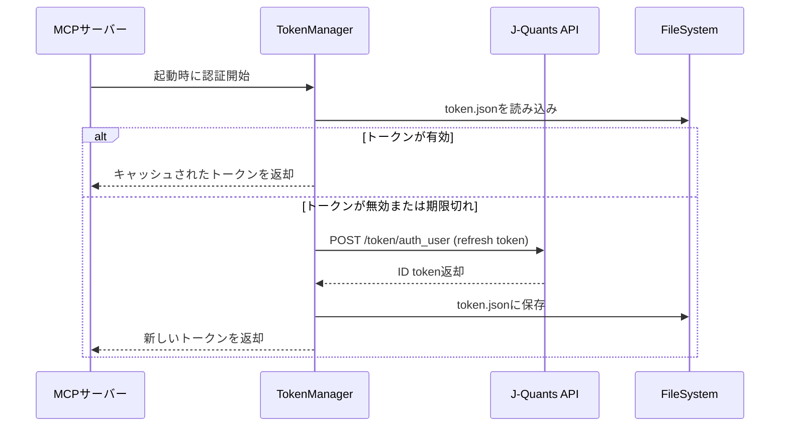
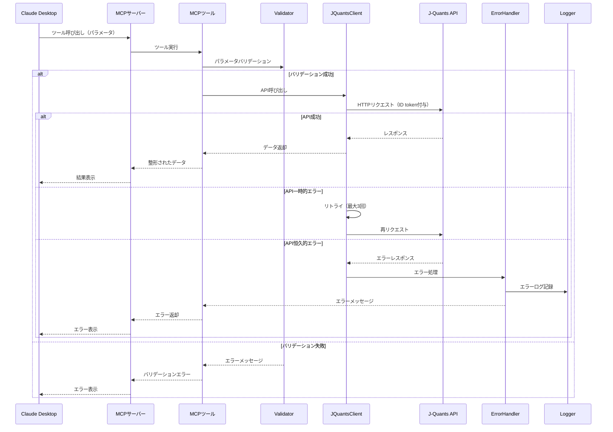

# J-Quants MCP Server アーキテクチャ設計

## システム概要 🔵

J-Quants MCP Serverは、J-Quants APIを通じて日本株の株価・財務情報を取得し、Claude等のAIアシスタントに提供するMCPサーバーです。ローカル環境で動作し、@modelcontextprotocol/sdkを使用して実装されます。

**対象要件**: 要件定義書全体（REQ-001～REQ-1202）
**信頼性**: 🔵 要件定義書・tech-stack.mdに基づく

## アーキテクチャパターン

### 選択パターン: レイヤードアーキテクチャ 🔵

```
┌─────────────────────────────────────┐
│   MCP Protocol Layer                │  ← @modelcontextprotocol/sdk
│   (Claude Desktop Integration)      │
└─────────────────────────────────────┘
              ↓↑
┌─────────────────────────────────────┐
│   MCP Tools Layer                   │  ← 4つのMCPツール
│   - get_listed_companies            │
│   - get_stock_price                 │
│   - get_financial_statements        │
│   - get_company_info                │
└─────────────────────────────────────┘
              ↓↑
┌─────────────────────────────────────┐
│   Business Logic Layer              │  ← データ変換・バリデーション
│   - Parameter validation            │
│   - Response formatting             │
│   - Error handling                  │
└─────────────────────────────────────┘
              ↓↑
┌─────────────────────────────────────┐
│   API Client Layer                  │  ← J-Quants API通信
│   - Authentication                  │
│   - HTTP requests (fetch/axios)     │
│   - Retry logic                     │
│   - Rate limiting                   │
└─────────────────────────────────────┘
              ↓↑
┌─────────────────────────────────────┐
│   Data Layer                        │  ← トークンキャッシュ
│   - Token cache (JSON file)         │
│   - Log files                       │
└─────────────────────────────────────┘
```

**選択理由**: 🔵 要件定義書REQ-1001, REQ-1002, REQ-1003より
- 各層が独立しており、テスト・保守が容易
- MCPプロトコルとビジネスロジックを分離
- J-Quants API仕様変更時の影響を最小化

## コンポーネント構成

### 1. MCPサーバー本体 🔵

**責務**:
- MCPプロトコルの処理
- Claudeとの通信管理
- ツールの登録・公開

**技術スタック**:
- @modelcontextprotocol/sdk
- TypeScript 5.x + Node.js 20 LTS

**実装ファイル**: `src/index.ts`

**要件根拠**: REQ-1001, REQ-1002

---

### 2. MCPツール実装 🔵

各MCPツールを独立したモジュールとして実装：

#### 2.1 get_listed_companies 🔵
- **ファイル**: `src/tools/get-listed-companies.ts`
- **機能**: 上場銘柄一覧の取得
- **入力**: `{ market?: string, sector?: string }`
- **出力**: `{ companies: Company[] }`
- **要件根拠**: REQ-101, REQ-102, REQ-501, REQ-502

#### 2.2 get_stock_price 🔵
- **ファイル**: `src/tools/get-stock-price.ts`
- **機能**: 株価データの取得
- **入力**: `{ code: string, from_date?: string, to_date?: string }`
- **出力**: `{ code: string, prices: StockPrice[] }`
- **要件根拠**: REQ-201, REQ-202, REQ-203, REQ-503, REQ-504

#### 2.3 get_financial_statements 🔵
- **ファイル**: `src/tools/get-financial-statements.ts`
- **機能**: 財務諸表の取得
- **入力**: `{ code: string, statement_type?: string }`
- **出力**: `{ code: string, fiscal_year: string, balance_sheet, profit_loss, cash_flow }`
- **要件根拠**: REQ-301, REQ-302

#### 2.4 get_company_info 🔵
- **ファイル**: `src/tools/get-company-info.ts`
- **機能**: 企業詳細情報の取得
- **入力**: `{ code: string }`
- **出力**: `{ code, name, market, sector, latest_price }`
- **要件根拠**: REQ-401, REQ-402

---

### 3. J-Quants APIクライアント 🔵

**ファイル**: `src/api/j-quants-client.ts`

**責務**:
- J-Quants APIへのHTTPリクエスト
- 認証トークンの管理
- リトライロジックの実装
- レート制限の処理

**主要メソッド**:
```typescript
class JQuantsClient {
  authenticate(): Promise<string>           // REQ-001, REQ-002
  getListedInfo(): Promise<Company[]>       // REQ-101
  getDailyQuotes(): Promise<StockPrice[]>   // REQ-201
  getFinancialStatements(): Promise<FinancialStatements> // REQ-301
  // ...
}
```

**要件根拠**: REQ-001～REQ-004, REQ-601～REQ-605

---

### 4. 認証モジュール 🔵

**ファイル**: `src/auth/token-manager.ts`

**責務**:
- リフレッシュトークンからIDトークンの取得
- トークンのJSONファイルへのキャッシュ
- トークン有効期限の管理

**主要メソッド**:
```typescript
class TokenManager {
  getIdToken(): Promise<string>             // REQ-002
  cacheToken(token: string): void           // REQ-003
  isTokenExpired(): boolean                 // REQ-604
  refreshToken(): Promise<string>           // REQ-604
}
```

**データファイル**: `data/token.json`

**要件根拠**: REQ-001～REQ-004, REQ-604, REQ-1003

---

### 5. バリデーション・エラーハンドリング 🔵

#### 5.1 バリデーター 🔵
**ファイル**: `src/utils/validator.ts`

**責務**:
- 必須パラメータのチェック
- 基本的な形式チェック

**要件根拠**: REQ-701

#### 5.2 エラーハンドラー 🔵
**ファイル**: `src/utils/error-handler.ts`

**責務**:
- エラーのログ記録
- ユーザー向けエラーメッセージの生成
- リトライロジック

**要件根拠**: REQ-601, REQ-602, REQ-603

---

### 6. ロガー 🔵

**ファイル**: `src/utils/logger.ts`

**責務**:
- エラーログの記録
- デバッグログの出力（オプション）

**ログファイル**: `logs/error.log`, `logs/debug.log`

**要件根拠**: REQ-602, REQ-901

---

## ディレクトリ構造 🔵

```
servers/j-quants/
├── src/
│   ├── index.ts                      # MCPサーバーエントリーポイント
│   ├── types/
│   │   └── index.ts                  # TypeScript型定義
│   ├── tools/
│   │   ├── get-listed-companies.ts   # MCPツール1
│   │   ├── get-stock-price.ts        # MCPツール2
│   │   ├── get-financial-statements.ts # MCPツール3
│   │   └── get-company-info.ts       # MCPツール4
│   ├── api/
│   │   ├── j-quants-client.ts        # J-Quants APIクライアント
│   │   └── endpoints.ts              # APIエンドポイント定義
│   ├── auth/
│   │   └── token-manager.ts          # トークン管理
│   ├── utils/
│   │   ├── validator.ts              # バリデーション
│   │   ├── error-handler.ts          # エラーハンドリング
│   │   ├── logger.ts                 # ロギング
│   │   └── retry.ts                  # リトライロジック
│   └── config/
│       └── constants.ts              # 定数定義
├── data/
│   └── token.json                    # トークンキャッシュ
├── logs/
│   ├── error.log                     # エラーログ
│   └── debug.log                     # デバッグログ
├── tests/
│   └── ...                           # テストファイル
├── docs/
│   ├── spec/                         # 要件定義
│   └── design/                       # 設計文書（本ファイル）
├── .env                              # 環境変数（.gitignore）
├── .gitignore
├── package.json
├── tsconfig.json
└── README.md
```

**要件根拠**: tech-stack.md 推奨ディレクトリ構造

---

## データフロー

### 起動時の認証フロー 🔵



**要件根拠**: REQ-001～REQ-004, REQ-604

---

### MCPツール呼び出しフロー 🔵



**要件根拠**: REQ-601～REQ-605, REQ-701

---

## 技術選定の根拠

### 1. TypeScript 5.x + Node.js 20 LTS 🔵
- **理由**: REQ-1001に基づく必須要件
- **メリット**: 型安全性、豊富なエコシステム、チームの技術スキル活用

### 2. @modelcontextprotocol/sdk 🔵
- **理由**: REQ-1002に基づく必須要件
- **メリット**: MCPプロトコルの公式実装、TypeScript完全対応

### 3. fetch API (Node.js 18+) 🟡
- **理由**: 追加依存なし、標準API
- **代替案**: axios（より高機能だが依存追加）
- **選択根拠**: tech-stack.mdのコスト最小化方針

### 4. JSONファイル（トークンキャッシュ） 🔵
- **理由**: REQ-1003に基づく必須要件
- **メリット**: シンプル、セットアップ不要

### 5. 環境変数（.env） 🔵
- **理由**: REQ-1101に基づく必須要件
- **ライブラリ**: dotenv
- **メリット**: セキュリティ、Git管理外

---

## 非機能要件への対応

### パフォーマンス 🔵

**NFR-001: 5秒以内のレスポンス**
- タイムアウト設定: 5秒（REQ-603）
- 実装: fetch APIのAbortSignal使用

**NFR-002: 起動時10秒以内**
- トークンキャッシュによる高速化
- 並列処理の最適化

**NFR-003: メモリ使用量500MB以下**
- データキャッシュなし（ユーザーヒアリング）
- ストリーミング処理の活用

### 可用性 🔵

**NFR-101, NFR-102: エラー時の安定性**
- try-catch による適切なエラーハンドリング
- process.on('uncaughtException') でクラッシュ防止

### 保守性 🔵

**NFR-201: TypeScript strict mode**
- tsconfig.json で strict: true 設定

**NFR-202: ESLint エラー0件**
- ESLint + Prettier による自動チェック

**NFR-203: コメント記載**
- 各関数にJSDocコメント
- 複雑なロジックに詳細コメント

### ユーザビリティ 🔵

**NFR-301: 日本語エラーメッセージ**
- error-handler.ts で日本語メッセージ生成
- エラーコードごとの分かりやすいメッセージ

**NFR-302: 日本語ツール説明**
- 各MCPツールに日本語の説明を記載

---

## セキュリティ設計 🔵

### 認証・認可
- **認証**: J-Quants APIのリフレッシュトークン + IDトークン
- **認可**: なし（教育目的のため省略）
- **要件根拠**: REQ-001～REQ-004

### データ保護
- **環境変数**: .env ファイルでAPIキー管理（REQ-1101）
- **.gitignore**: .env, data/, logs/ を除外（REQ-1102）
- **個人情報**: 扱わない（REQ-1103）

### ログ管理
- **エラーログ**: 個人情報を含めない
- **デバッグログ**: オプション、開発時のみ

---

## エラーハンドリング戦略 🔵

### 1. リトライロジック（REQ-601, REQ-605）

```typescript
async function retryableRequest<T>(
  fn: () => Promise<T>,
  maxRetries: number = 3,
  delay: number = 1000
): Promise<T> {
  for (let i = 0; i < maxRetries; i++) {
    try {
      return await fn();
    } catch (error) {
      if (i === maxRetries - 1) throw error;
      if (isRetryableError(error)) {
        await sleep(delay * (i + 1)); // Exponential backoff
      } else {
        throw error;
      }
    }
  }
}
```

### 2. タイムアウト処理（REQ-603）

```typescript
const controller = new AbortController();
const timeoutId = setTimeout(() => controller.abort(), 5000);

try {
  const response = await fetch(url, {
    signal: controller.signal,
    headers: { Authorization: `Bearer ${token}` }
  });
} finally {
  clearTimeout(timeoutId);
}
```

### 3. エラーメッセージ（NFR-301）

```typescript
const errorMessages = {
  INVALID_CODE: '指定された銘柄コード（{code}）は存在しません',
  INVALID_DATE: '日付はYYYY-MM-DD形式で指定してください',
  API_ERROR: 'J-Quants APIへの接続に失敗しました',
  TIMEOUT: 'APIの応答がタイムアウトしました（5秒）',
  // ...
};
```

---

## テスト戦略 🟡

### 単体テスト
- **フレームワーク**: Vitest
- **対象**: 各ツール、API Client、Validator
- **カバレッジ**: 任意（教育目的）

### 統合テスト
- **対象**: MCP Protocol ↔ Tools ↔ J-Quants API
- **方法**: Claude Desktop経由での動作確認

### E2Eテスト
- **対象**: 実際のJ-Quants APIとの連携
- **方法**: 手動テスト（フリープランの制約があるため）

---

## デプロイ・運用 🔵

### デプロイ環境
- **環境**: ローカル環境のみ（REQ-1004）
- **要件**: Node.js 20 LTS 以上

### 起動方法
```bash
# 開発モード
npm run dev

# 本番モード
npm run build
npm start
```

### Claude Desktop連携設定
```json
{
  "mcpServers": {
    "j-quants": {
      "command": "node",
      "args": ["/path/to/servers/j-quants/dist/index.js"],
      "env": {
        "NODE_ENV": "production"
      }
    }
  }
}
```

---

## 制約事項・前提条件 🔵

### J-Quants APIの制約
1. **データ遅延**: 12週間（REQ-1201）
2. **データ期間**: 過去2年分（REQ-1202）
3. **レート制限**: 詳細はJ-Quants APIドキュメント参照

### 技術的制約
1. **ローカル環境のみ**: REQ-1004
2. **JSONファイルストレージ**: REQ-1003
3. **TypeScript + Node.js**: REQ-1001

### 前提条件
1. J-Quants APIフリープラン登録済み
2. リフレッシュトークン取得済み
3. Node.js 20 LTS以上インストール済み

---

## Phase別実装スコープ

### Phase 1: MVP 🔵
- 認証機能
- 4つのMCPツール（get_listed_companies, get_stock_price, get_financial_statements, get_company_info）
- 基本的なエラーハンドリング

### Phase 2: 拡張機能 🟡
- 検索機能（search_companies）
- 配当情報（get_dividend_info）
- 取引カレンダー（get_trading_calendar）
- 詳細なエラーメッセージ

### Phase 3: 高度な分析 🟡
- 市場情報ツール
- デリバティブ情報
- パフォーマンス最適化

---

## 参考資料

- 要件定義書: `docs/spec/j-quants-requirements.md`
- ユーザーストーリー: `docs/spec/j-quants-user-stories.md`
- 受け入れ基準: `docs/spec/j-quants-acceptance-criteria.md`
- 技術スタック: `../../../docs/tech-stack.md`
- J-Quants API: https://jpx.gitbook.io/j-quants-ja
- MCP仕様: https://modelcontextprotocol.io/

---

## 更新履歴

- 2025-10-29: 初版作成（kairo-design コマンドにより作成）
  - レイヤードアーキテクチャ採用
  - 6つの主要コンポーネント定義
  - データフロー図作成（Mermaid）
  - 信頼性レベル（🔵🟡🔴）の明記
