# J-Quants MCP Server データフロー図

## 概要 🔵

このドキュメントは、J-Quants MCP Serverのデータフローを可視化します。システム内でのデータの流れ、各コンポーネント間のやり取り、エラーハンドリングのフローを詳細に記述します。

**要件根拠**: 要件定義書全体（REQ-001～REQ-1202）、architecture.md

---

## システム全体のデータフロー 🔵

### 概要図

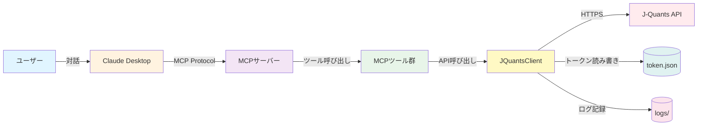

**要件根拠**: REQ-1001, REQ-1002, REQ-1003, REQ-602

---

## Phase 1: 起動・認証フロー 🔵

### 1.1 システム起動時の認証

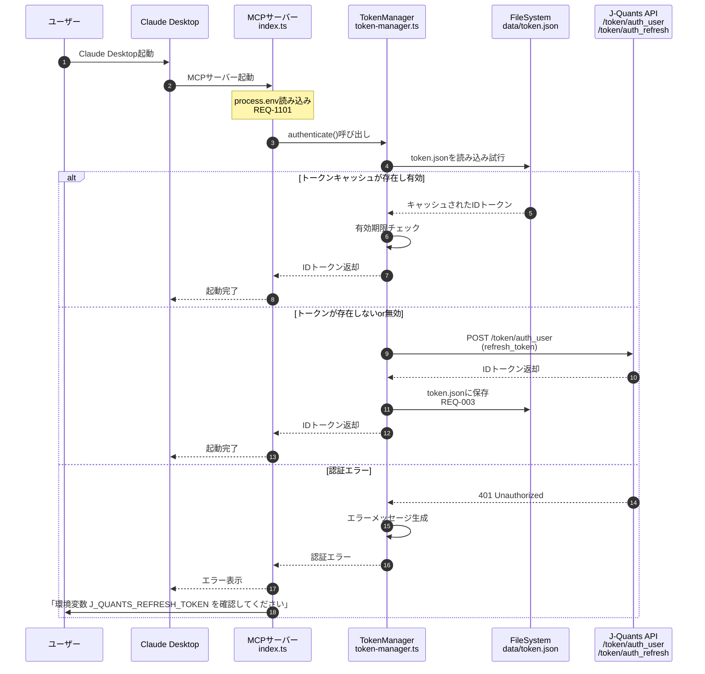

**要件根拠**:
- REQ-001: 起動時にJ-Quants APIへの認証を実行
- REQ-002: リフレッシュトークンを使用してIDトークンを取得
- REQ-003: 取得したIDトークンをJSONファイルにキャッシュ
- REQ-1101: APIキー・リフレッシュトークンを環境変数から読み込み

**信頼性**: 🔵 要件定義書に基づく

---

### 1.2 トークン再取得フロー（有効期限切れ時）

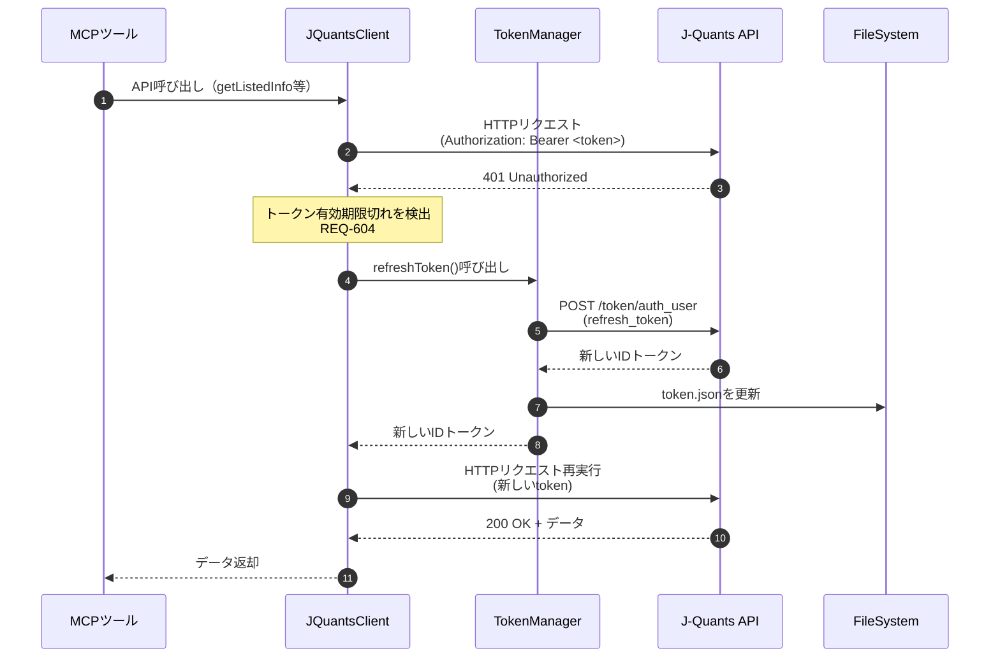

**要件根拠**: REQ-604（認証トークンの有効期限が切れた場合、自動的にトークンを再取得）

**信頼性**: 🔵 要件定義書に基づく

---

## Phase 2: MCPツール呼び出しフロー 🔵

### 2.1 get_listed_companies フロー

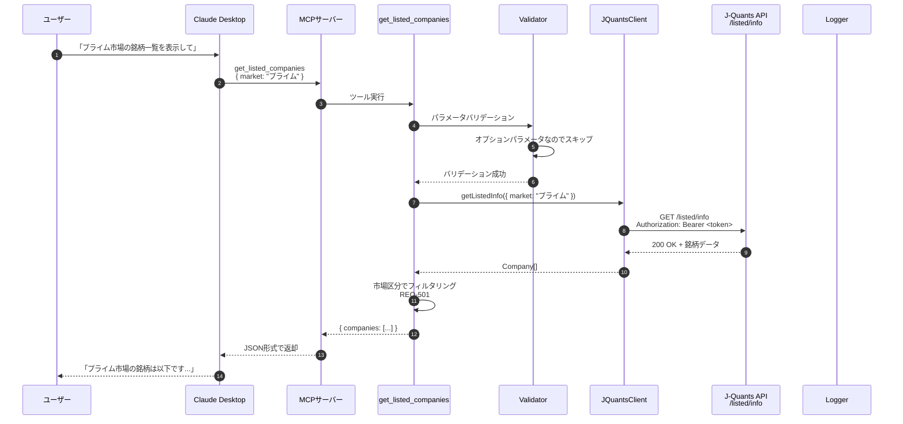

**要件根拠**:
- REQ-101: 上場銘柄一覧を取得するMCPツール提供
- REQ-102: 銘柄コード、会社名、市場区分、業種を含む
- REQ-501: 市場区分パラメータが指定された場合、指定された市場の銘柄のみを返却

**信頼性**: 🔵 要件定義書に基づく

---

### 2.2 get_stock_price フロー（正常系）

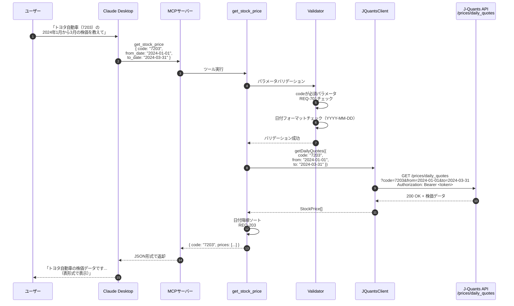

**要件根拠**:
- REQ-201: 指定銘柄の株価データを取得するMCPツール提供
- REQ-202: 株価データに始値・高値・安値・終値・出来高を含む
- REQ-203: 株価データを日付降順で返却
- REQ-503: 取得開始日パラメータが指定された場合、指定日以降の株価データを返却
- REQ-504: 取得終了日パラメータが指定された場合、指定日以前の株価データを返却
- REQ-701: 必須パラメータが未指定の場合、エラーメッセージを返却

**信頼性**: 🔵 要件定義書に基づく

---

### 2.3 get_financial_statements フロー

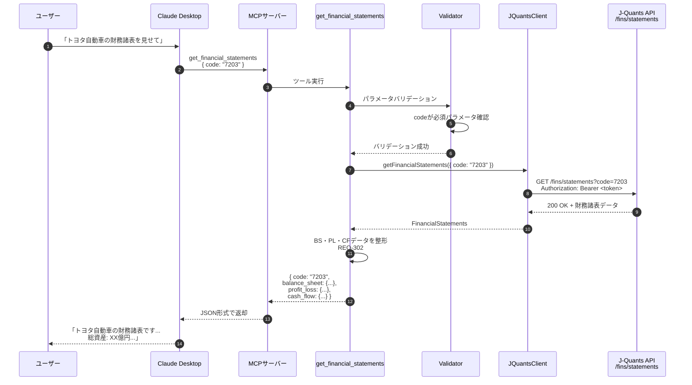

**要件根拠**:
- REQ-301: 指定銘柄の財務諸表を取得するMCPツール提供
- REQ-302: 貸借対照表・損益計算書・キャッシュフロー計算書を含む

**信頼性**: 🔵 要件定義書に基づく

---

### 2.4 get_company_info フロー

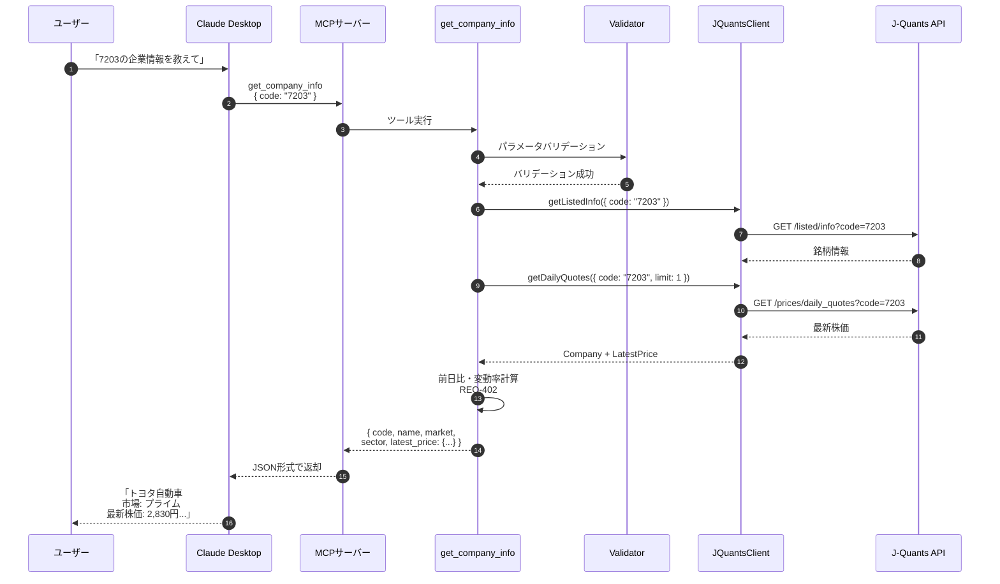

**要件根拠**:
- REQ-401: 指定銘柄の企業詳細情報を取得するMCPツール提供
- REQ-402: 銘柄コード、会社名、市場区分、業種、最新株価を含む

**信頼性**: 🔵 要件定義書に基づく

---

## Phase 3: エラーハンドリングフロー 🔵

### 3.1 リトライロジック（一時的エラー）

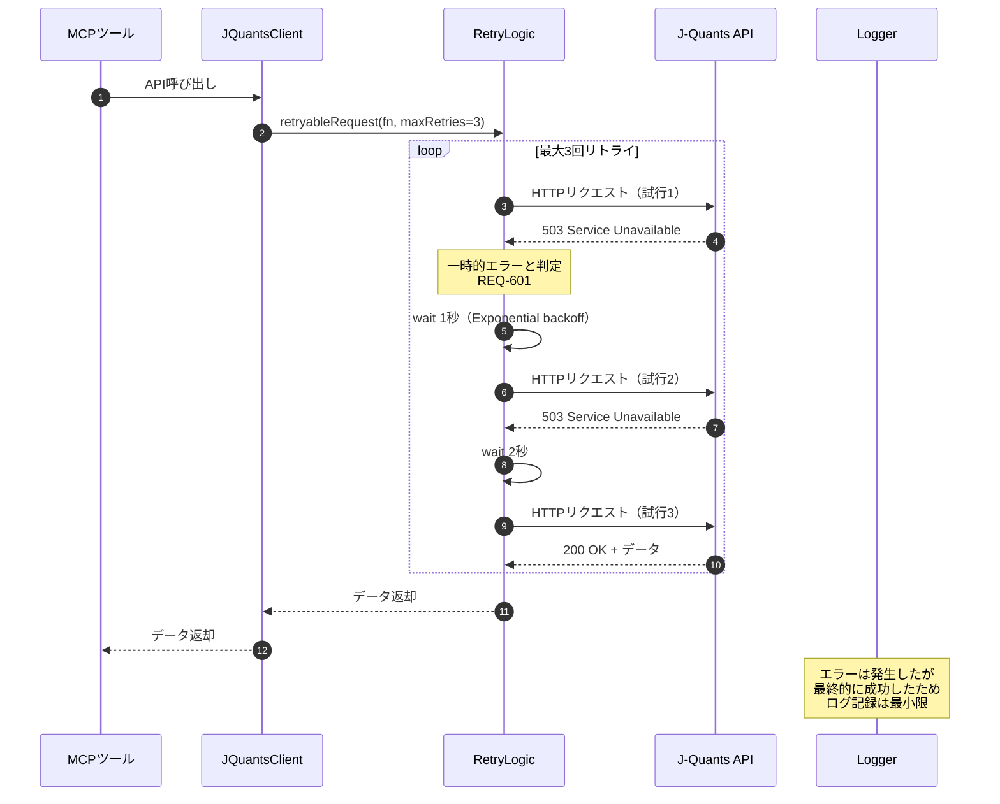

**要件根拠**:
- REQ-601: API呼び出しが一時的エラーで失敗した場合、最大3回まで自動的に再試行

**信頼性**: 🔵 要件定義書・ユーザーヒアリングに基づく

---

### 3.2 エラーログ記録フロー

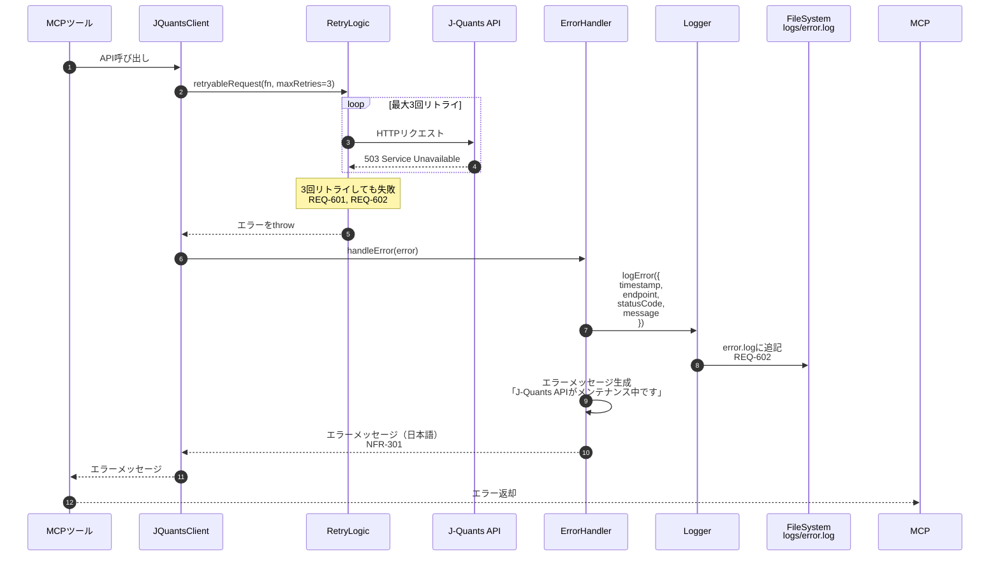

**要件根拠**:
- REQ-601: 最大3回まで自動的に再試行
- REQ-602: API呼び出しが失敗した場合、エラー内容をログファイルに記録
- NFR-301: エラーメッセージを日本語で分かりやすく表示

**信頼性**: 🔵 要件定義書・ユーザーヒアリングに基づく

---

### 3.3 タイムアウト処理フロー

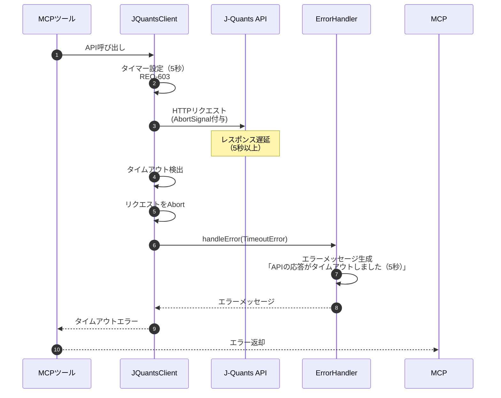

**要件根拠**:
- REQ-603: APIリクエストが5秒以内に完了しない場合、タイムアウトエラーを返却
- NFR-001: システムは1つのAPIリクエストを5秒以内に完了

**信頼性**: 🔵 要件定義書・ユーザーヒアリングに基づく

---

### 3.4 バリデーションエラーフロー

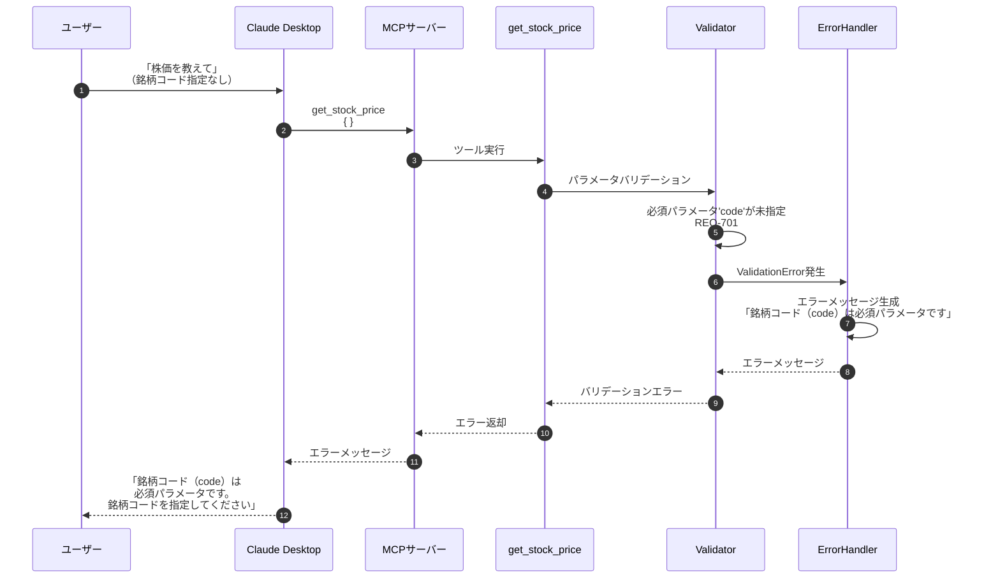

**要件根拠**:
- REQ-701: 必須パラメータが未指定の場合、分かりやすいエラーメッセージを返却

**信頼性**: 🔵 要件定義書・ユーザーヒアリングに基づく

---

## Phase 4: データ処理フロー 🟡

### 4.1 銘柄データのフィルタリング

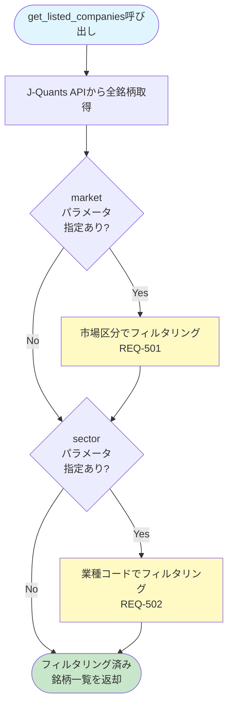

**要件根拠**:
- REQ-501: 市場区分パラメータが指定された場合、指定された市場の銘柄のみを返却
- REQ-502: 業種コードパラメータが指定された場合、指定された業種の銘柄のみを返却

**信頼性**: 🔵 要件定義書に基づく

---

### 4.2 株価データのソート

```mermaid
flowchart TD
    Start([get_stock_price呼び出し]) --> GetPrices[J-Quants APIから株価データ取得]
    GetPrices --> Parse[JSONレスポンスをパース]
    Parse --> Sort[日付降順ソート<br/>REQ-203]
    Sort --> Format[StockPrice[]型に変換]
    Format --> Return([株価データを返却])

    style Start fill:#e1f5ff
    style Return fill:#c8e6c9
    style Sort fill:#fff9c4
```

**要件根拠**:
- REQ-203: 株価データを日付降順（新しい順）で返却

**信頼性**: 🔵 要件定義書に基づく

---

### 4.3 企業情報と最新株価の統合

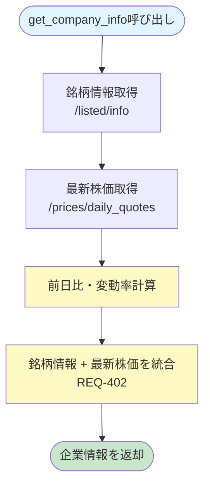

**要件根拠**:
- REQ-402: 企業情報に銘柄コード、会社名、市場区分、業種、最新株価を含める

**信頼性**: 🔵 要件定義書に基づく

---

## Phase 5: ログ・モニタリングフロー 🟡

### 5.1 ログ記録フロー

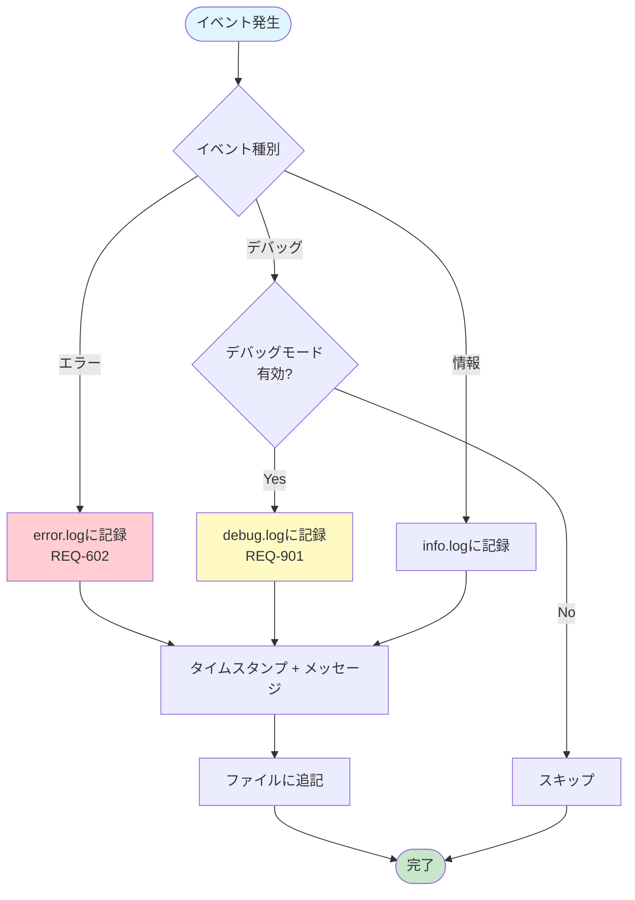

**要件根拠**:
- REQ-602: API呼び出しが失敗した場合、エラー内容をログファイルに記録
- REQ-901: デバッグモードでAPIリクエスト・レスポンスの詳細をログ出力してもよい

**信頼性**: 🔵🟡 要件定義書に基づく（デバッグモードは🟡推測）

---

## Phase 6: パフォーマンス最適化フロー 🟡

### 6.1 レート制限対応フロー

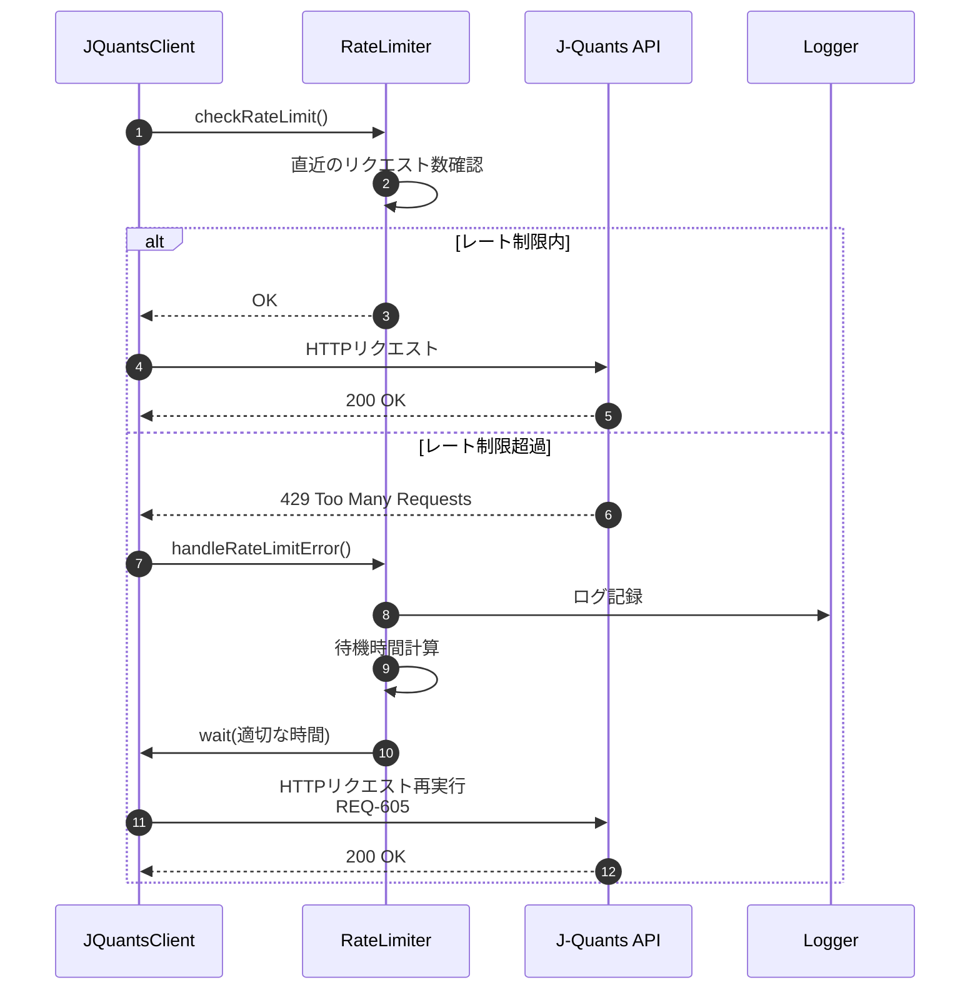

**要件根拠**:
- REQ-605: レート制限エラーが発生した場合、適切な待機時間後に再試行

**信頼性**: 🔵 要件定義書に基づく

---

## データ構造の変換フロー 🟡

### 7.1 J-Quants API → MCPツール 型変換

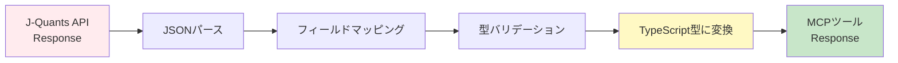

**例**:
```
J-Quants API: { Code: "7203", CompanyName: "トヨタ自動車(株)" }
        ↓
変換処理: フィールド名を小文字に、株式会社を除去
        ↓
MCP Response: { code: "7203", name: "トヨタ自動車" }
```

**信頼性**: 🟡 実装詳細から推測

---

## まとめ 🔵

### 主要なデータフロー

1. **起動・認証**: リフレッシュトークン → IDトークン → キャッシュ
2. **MCPツール呼び出し**: Claude → MCP → Tools → API Client → J-Quants API
3. **エラーハンドリング**: リトライ → ログ記録 → エラーメッセージ
4. **データ処理**: フィルタリング → ソート → 型変換

### パフォーマンスへの配慮

- トークンキャッシュによる認証回数削減
- タイムアウト設定（5秒）
- Exponential backoffによるリトライ
- レート制限への対応

### 可読性・保守性への配慮

- レイヤードアーキテクチャによる関心の分離
- エラーハンドリングの一元管理
- 日本語エラーメッセージ
- 詳細なログ記録

---

## 参考資料

- アーキテクチャ設計: `architecture.md`
- 要件定義書: `../spec/j-quants-requirements.md`
- J-Quants API: https://jpx.gitbook.io/j-quants-ja
- MCP仕様: https://modelcontextprotocol.io/

---

## 更新履歴

- 2025-10-29: 初版作成（kairo-design コマンドにより作成）
  - 7つの主要データフローを可視化（Mermaid）
  - 各フローに要件根拠を明記
  - 信頼性レベル（🔵🟡🔴）の明記
