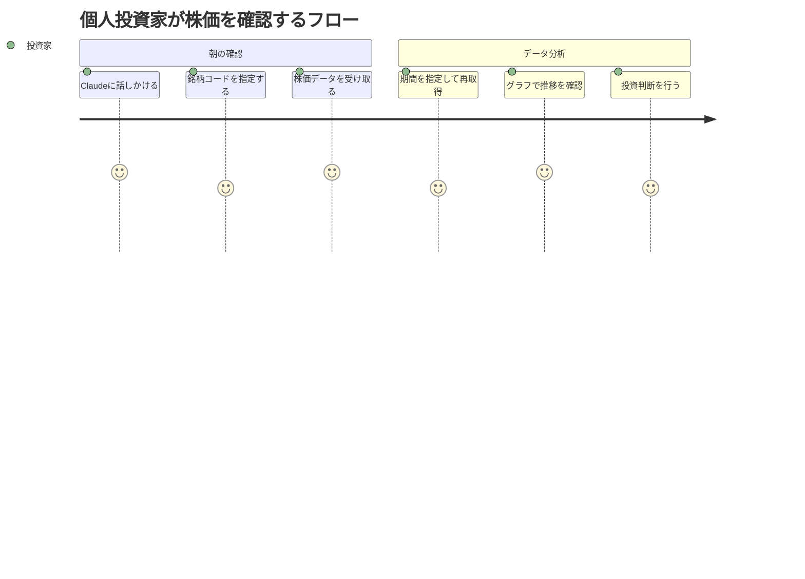
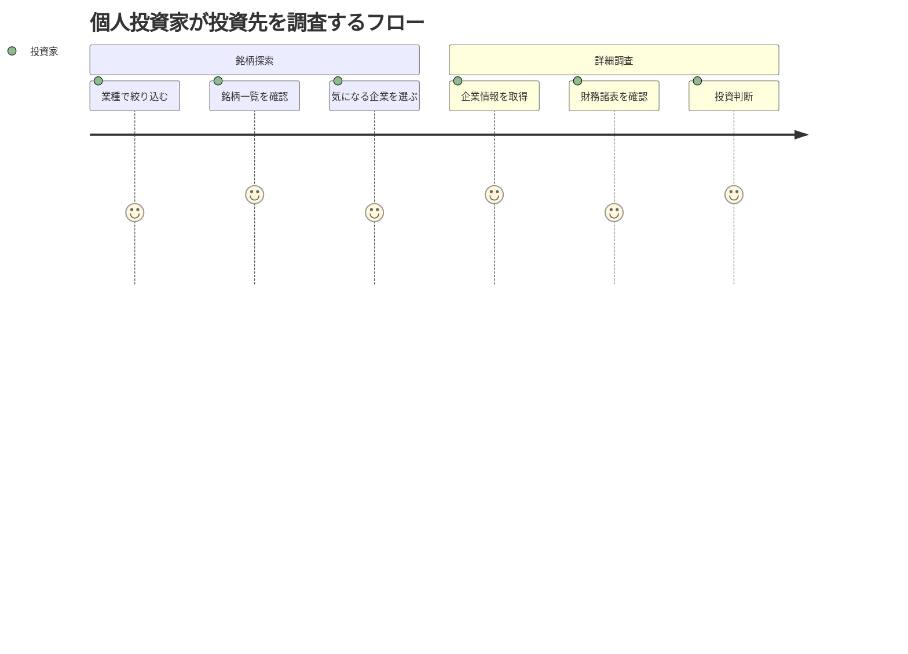

# J-Quants MCP Server ユーザストーリー

## 概要

このドキュメントはJ-Quants MCP Server機能の詳細なユーザストーリーを記載します。

## ユーザー種別の定義

### プライマリユーザー

- **個人投資家**: 日本株の投資判断のために株価・財務情報を分析したい個人
- **データ分析者**: 日本株市場のデータを収集・分析して洞察を得たい人
- **学習者**: MCPサーバーの実装を学びたいMIJS秋合宿の参加者

### セカンダリユーザー

- **AIアシスタント（Claude）**: MCPツールを呼び出してユーザーに情報を提供するAI
- **開発者**: このMCPサーバーを拡張・カスタマイズしたい開発者

## ユーザストーリー

**【信頼性レベル凡例】**:
- 🔵 **青信号**: REQUIREMENTS.md・技術スタック・ユーザーヒアリングを参考にした確実なストーリー
- 🟡 **黄信号**: 既存資料から妥当な推測によるストーリー
- 🔴 **赤信号**: 既存資料にない推測によるストーリー

### 📚 エピック1: 株価情報の取得 🔵 *REQUIREMENTS.md Phase 1より*

#### ストーリー1.1: 特定銘柄の株価を確認したい 🔵 *REQ-201, REQ-202より*

**ユーザストーリー**:
- **私は** 個人投資家 **として**
- **保有銘柄や気になる銘柄の株価推移を確認したい際に**
- **銘柄コードを指定して株価データ（始値・高値・安値・終値・出来高）を取得したい**
- **そうすることで** 投資判断の材料となる価格推移を把握できる

**詳細説明**:
- **背景**: 日本株の投資判断には株価の推移を確認することが不可欠
- **前提条件**: J-Quants APIのフリープランに登録済み、リフレッシュトークンを取得済み
- **利用シーン**:
  - 朝、出勤前に保有銘柄の前日の株価を確認する
  - 気になるニュースがあった企業の株価推移を調べる
  - 複数銘柄の株価を比較して投資先を検討する
- **期待する体験**: Claudeに「トヨタ自動車（7203）の過去3ヶ月の株価を教えて」と聞くだけで、株価データが表示される

**関連要件**: REQ-201, REQ-202, REQ-203, REQ-503, REQ-504

**優先度**: 高

**見積もり**: 3日

#### ストーリー1.2: 期間を指定して株価を取得したい 🔵 *REQ-503, REQ-504より*

**ユーザストーリー**:
- **私は** データ分析者 **として**
- **特定期間の株価データで分析を行いたい際に**
- **開始日と終了日を指定して株価データを取得したい**
- **そうすることで** 任意の期間での株価分析が可能になる

**詳細説明**:
- **背景**: データ分析では特定期間のデータを抽出することが重要
- **前提条件**: 分析対象期間がフリープランの制約内（過去2年分、12週間遅延）
- **利用シーン**:
  - 決算発表前後の株価変動を分析する
  - 特定のイベント（新製品発表等）前後の株価を比較する
  - 四半期ごとの株価推移を集計する
- **期待する体験**: 「2024年1月から3月のトヨタ自動車の株価を取得して」と指示するだけで、該当期間のデータが得られる

**関連要件**: REQ-503, REQ-504, EDGE-101, EDGE-102

**優先度**: 高

**見積もり**: 1日

---

### 📚 エピック2: 企業情報の取得 🔵 *REQUIREMENTS.md Phase 1より*

#### ストーリー2.1: 上場銘柄一覧を確認したい 🔵 *REQ-101, REQ-102より*

**ユーザストーリー**:
- **私は** 個人投資家 **として**
- **投資先を検討する際に**
- **市場に上場している銘柄の一覧を確認したい**
- **そうすることで** 投資候補を見つけられる

**詳細説明**:
- **背景**: 日本株市場には数千の上場企業があり、全体を把握することが難しい
- **前提条件**: J-Quants APIに接続可能
- **利用シーン**:
  - プライム市場の全銘柄を確認する
  - 特定業種（例：輸送用機器）の銘柄を探す
  - グロース市場の新興企業を調査する
- **期待する体験**: 「プライム市場の銘柄一覧を表示して」と聞くだけで、該当銘柄の一覧が表示される

**関連要件**: REQ-101, REQ-102, REQ-501, REQ-502

**優先度**: 高

**見積もり**: 2日

#### ストーリー2.2: 企業の詳細情報を確認したい 🔵 *REQ-401, REQ-402より*

**ユーザストーリー**:
- **私は** 個人投資家 **として**
- **特定企業に投資を検討している際に**
- **企業名、業種、市場区分、最新株価などの基本情報を一度に確認したい**
- **そうすることで** 企業の概要を素早く把握できる

**詳細説明**:
- **背景**: 投資判断には企業の基本情報と最新株価を総合的に確認する必要がある
- **前提条件**: 銘柄コードが分かっている
- **利用シーン**:
  - 気になるニュースで企業名を見た際に、その企業の詳細を調べる
  - 複数の企業を比較検討する際に、基本情報を並べて確認する
- **期待する体験**: 「7203の企業情報を教えて」と聞くだけで、トヨタ自動車の詳細情報が表示される

**関連要件**: REQ-401, REQ-402

**優先度**: 高

**見積もり**: 2日

---

### 📚 エピック3: 財務情報の取得 🔵 *REQUIREMENTS.md Phase 1より*

#### ストーリー3.1: 企業の財務諸表を確認したい 🔵 *REQ-301, REQ-302より*

**ユーザストーリー**:
- **私は** 個人投資家 **として**
- **企業の財務健全性を評価したい際に**
- **貸借対照表、損益計算書、キャッシュフロー計算書を取得したい**
- **そうすることで** 企業の財務状況を多角的に分析できる

**詳細説明**:
- **背景**: 株価だけでなく、企業の財務データを分析することで投資リスクを評価できる
- **前提条件**: 対象企業が財務諸表を開示している
- **利用シーン**:
  - 企業の総資産・負債・純資産を確認する
  - 売上高・営業利益・純利益の推移を分析する
  - キャッシュフローの状況を評価する
- **期待する体験**: 「トヨタ自動車の財務諸表を表示して」と聞くだけで、BS・PL・CFのデータが表示される

**関連要件**: REQ-301, REQ-302

**優先度**: 高

**見積もり**: 3日

---

### 📚 エピック4: エラー対応と安定性 🔵 *REQ-601～REQ-605, ユーザーヒアリングより*

#### ストーリー4.1: APIエラー時も適切に対応してほしい 🔵 *REQ-601, REQ-602より*

**ユーザストーリー**:
- **私は** 個人投資家 **として**
- **APIエラーやネットワーク障害が発生した際に**
- **システムが自動的にリトライし、失敗時は分かりやすいエラーメッセージを表示してほしい**
- **そうすることで** 一時的な障害を気にせず利用でき、問題発生時も原因を把握できる

**詳細説明**:
- **背景**: ネットワークやAPIの一時的な障害は避けられないため、自動リトライが必要
- **前提条件**: インターネット接続が可能
- **利用シーン**:
  - API呼び出し中に一時的なネットワーク障害が発生する
  - J-Quants APIがメンテナンス中
  - レート制限に達した場合
- **期待する体験**: 一時的なエラーは自動的にリトライされ、ユーザーは気づかない。恒久的なエラーの場合は「J-Quants APIがメンテナンス中です」など分かりやすいメッセージが表示される

**関連要件**: REQ-601, REQ-602, REQ-603, REQ-604, REQ-605, EDGE-201, EDGE-202

**優先度**: 中

**見積もり**: 2日

#### ストーリー4.2: 不正な入力時にエラーメッセージを表示してほしい 🔵 *REQ-701, EDGE-001, EDGE-002より*

**ユーザストーリー**:
- **私は** 個人投資家 **として**
- **誤った銘柄コードや日付を入力してしまった際に**
- **分かりやすいエラーメッセージで間違いを教えてほしい**
- **そうすることで** 正しい入力を行い、期待する情報を取得できる

**詳細説明**:
- **背景**: ユーザーは入力ミスをすることがあり、その際に適切なフィードバックが必要
- **前提条件**: MCPツールを使用中
- **利用シーン**:
  - 存在しない銘柄コードを入力した
  - 日付フォーマットを間違えた（例: 2024/10/01 → YYYY-MM-DD形式が正しい）
  - 必須パラメータを指定し忘れた
- **期待する体験**: 「指定された銘柄コード（9999）は存在しません」「日付はYYYY-MM-DD形式で指定してください」などの具体的なエラーメッセージが表示される

**関連要件**: REQ-701, EDGE-001, EDGE-002, EDGE-003

**優先度**: 中

**見積もり**: 1日

---

### 📚 エピック5: 学習と理解 🔵 *教育目的プロジェクトより*

#### ストーリー5.1: MCPサーバーの実装を学びたい 🔵 *tech-stack.md 目的より*

**ユーザストーリー**:
- **私は** MIJS秋合宿の参加者 **として**
- **MCPサーバーの実装方法を学びたい際に**
- **J-Quants MCP Serverのコードを読み、拡張できるようにしたい**
- **そうすることで** MCP技術への理解を深め、自分のプロジェクトに応用できる

**詳細説明**:
- **背景**: 教育目的プロジェクトとして、参加者の学習を支援する
- **前提条件**: TypeScript/Node.jsの基礎知識
- **利用シーン**:
  - コードを読んで認証フローを理解する
  - 新しいMCPツールを追加してみる
  - エラーハンドリングの実装を学ぶ
- **期待する体験**: コードが読みやすく、コメントが適切に記載されており、スムーズに学習できる

**関連要件**: NFR-203, NFR-302

**優先度**: 中

**見積もり**: -（ドキュメント作成）

---

## ユーザージャーニー

### ジャーニー1: 投資銘柄の株価確認フロー 🔵 *ストーリー1.1, 1.2より*

**詳細**:
1. **Claudeに話しかける**: 「トヨタ自動車の株価を教えて」
2. **銘柄コードを指定する**: Claudeが自動的に7203を認識
3. **株価データを受け取る**: 最新の株価データ（過去3ヶ月分）が表示される
4. **期間を指定して再取得**: 「2024年1月から3月のデータも見たい」
5. **グラフで推移を確認**: Claudeがグラフ化して表示（オプション機能）
6. **投資判断を行う**: データを基に投資を決定

### ジャーニー2: 投資先企業の調査フロー 🔵 *ストーリー2.1, 2.2, 3.1より*

**詳細**:
1. **業種で絞り込む**: 「輸送用機器業種の銘柄を教えて」
2. **銘柄一覧を確認**: 該当業種の全銘柄が表示される
3. **気になる企業を選ぶ**: トヨタ自動車（7203）を選択
4. **企業情報を取得**: 「7203の企業情報を教えて」
5. **財務諸表を確認**: 「トヨタ自動車の財務諸表も見たい」
6. **投資判断**: 総合的に判断して投資を決定

---

## ペルソナ定義

### ペルソナ1: 田中太郎（個人投資家） 🔵 *REQUIREMENTS.md 1.2対象ユーザーより*

- **基本情報**: 35歳、会社員、投資経験3年
- **ゴール**: 日本株投資で資産を増やしたい
- **課題**: 株価や財務データを効率的に収集・分析する方法が分からない
- **行動パターン**: 朝と夜に株価をチェックし、週末に投資分析を行う
- **利用環境**: Windows PC、Claude Desktop、週5-10時間の投資時間

### ペルソナ2: 佐藤花子（データ分析者） 🔵 *REQUIREMENTS.md 1.2対象ユーザーより*

- **基本情報**: 28歳、データサイエンティスト、Python・R使用経験
- **ゴール**: 日本株市場のデータを分析して洞察を得たい
- **課題**: J-Quants APIの使い方が分からず、データ取得に時間がかかる
- **行動パターン**: Claude経由でデータを取得し、Pythonで分析する
- **利用環境**: Mac、Claude Desktop、データ分析ツール連携

### ペルソナ3: 鈴木一郎（学習者） 🔵 *tech-stack.md 目的より*

- **基本情報**: 30歳、ソフトウェアエンジニア、TypeScript経験1年
- **ゴール**: MCPサーバーの実装方法を学びたい
- **課題**: MCPの仕様や実装パターンが分からない
- **行動パターン**: コードを読み、実際に動かして理解する
- **利用環境**: Windows/Mac、VS Code、Claude Code

---

## 非機能的ユーザー要求

### ユーザビリティ要求

- **学習容易性**: 初回利用時にREADME.mdを読めば10分で使い始められる
- **効率性**: 熟練後は1つの株価取得を10秒以内で完了できる
- **記憶しやすさ**: MCPツール名が直感的で覚えやすい（get_stock_price等）
- **エラー対応**: エラーメッセージが日本語で分かりやすく、対処法が明確
- **満足度**: Claude経由で簡単に日本株データを取得でき、満足度が高い

### アクセシビリティ要求

- **視覚**: Claudeのテキストベースインターフェースで視覚障害者も利用可能
- **聴覚**: 音声は不要、テキストのみで完結
- **運動**: マウス不要、キーボードのみで操作可能
- **認知**: エラーメッセージが簡潔で理解しやすい

---

## 更新履歴

- 2025-10-29: 初版作成（kairo-requirements コマンドにより作成）
  - 5つのエピック、9つのユーザーストーリー定義
  - 2つのユーザージャーニー図作成
  - 3つのペルソナ定義
