# コード解析MCP データフロー設計

## 概要

このドキュメントは、コード解析MCPサーバーの詳細なデータフロー図とシーケンス図を定義します。Mermaid記法を使用して、各ツールの処理フローを可視化します。

---

## 1. analyze_file ツールのデータフロー

### 1.1 全体フロー (キャッシュヒットの場合)

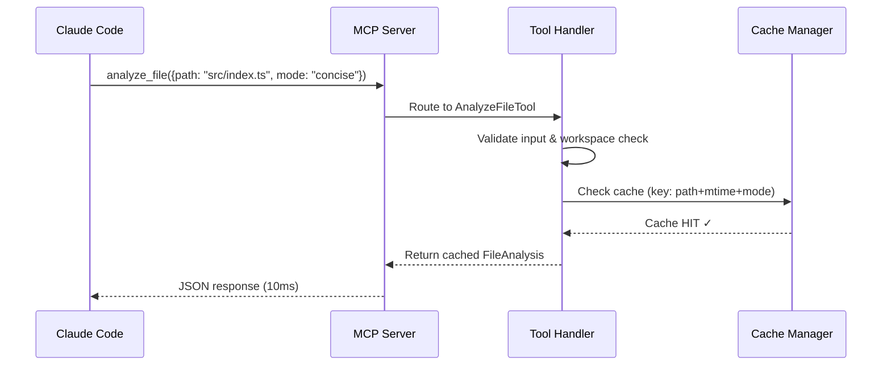
```mermaid
sequenceDiagram
    participant CC as Claude Code
    participant MCP as MCP Server
    participant TH as Tool Handler
    participant CM as Cache Manager

    CC->>MCP: analyze_file({path: "src/index.ts", mode: "concise"})
    MCP->>TH: Route to AnalyzeFileTool
    TH->>TH: Validate input & workspace check
    TH->>CM: Check cache (key: path+mtime+mode)
    CM-->>TH: Cache HIT ✓
    TH-->>MCP: Return cached FileAnalysis
    MCP-->>CC: JSON response (10ms)
```

### 1.2 全体フロー (キャッシュミスの場合)

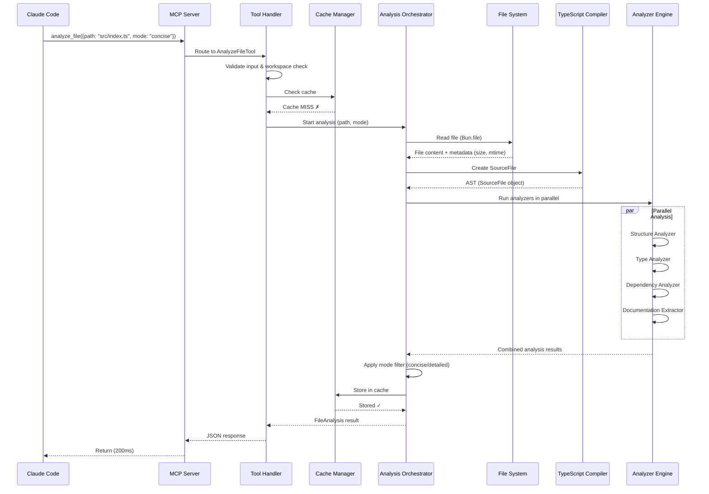
```mermaid
sequenceDiagram
    participant CC as Claude Code
    participant MCP as MCP Server
    participant TH as Tool Handler
    participant CM as Cache Manager
    participant AO as Analysis Orchestrator
    participant FS as File System
    participant TC as TypeScript Compiler
    participant AE as Analyzer Engine

    CC->>MCP: analyze_file({path: "src/index.ts", mode: "concise"})
    MCP->>TH: Route to AnalyzeFileTool
    TH->>TH: Validate input & workspace check
    TH->>CM: Check cache
    CM-->>TH: Cache MISS ✗

    TH->>AO: Start analysis (path, mode)
    AO->>FS: Read file (Bun.file)
    FS-->>AO: File content + metadata (size, mtime)

    AO->>TC: Create SourceFile
    TC-->>AO: AST (SourceFile object)

    AO->>AE: Run analyzers in parallel

    par Parallel Analysis
        AE->>AE: Structure Analyzer
        AE->>AE: Type Analyzer
        AE->>AE: Dependency Analyzer
        AE->>AE: Documentation Extractor
    end

    AE-->>AO: Combined analysis results

    AO->>AO: Apply mode filter (concise/detailed)
    AO->>CM: Store in cache
    CM-->>AO: Stored ✓

    AO-->>TH: FileAnalysis result
    TH-->>MCP: JSON response
    MCP-->>CC: Return (200ms)
```

### 1.3 エラー時のフロー (構文エラー)

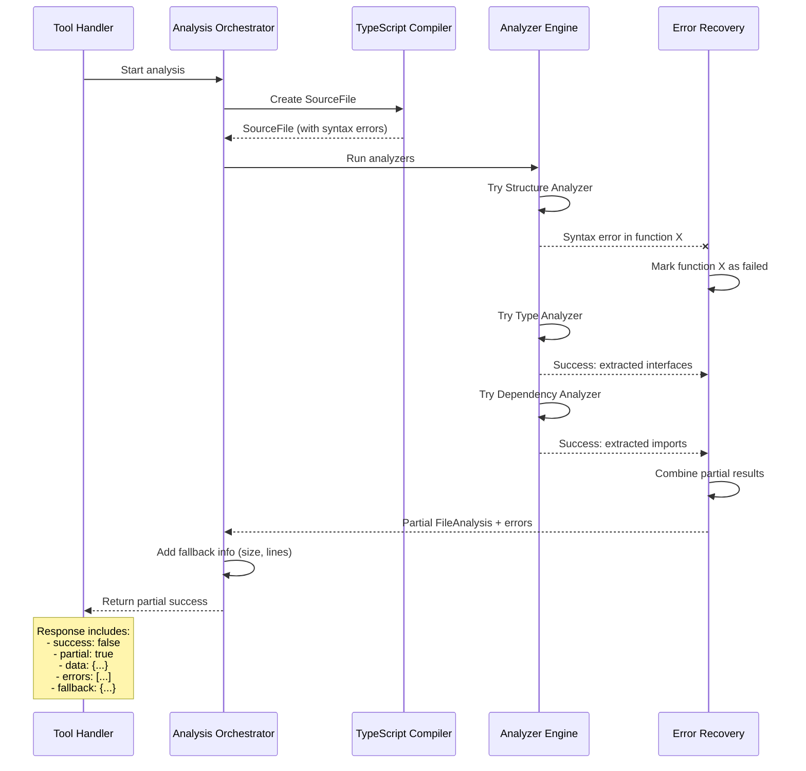
```mermaid
sequenceDiagram
    participant TH as Tool Handler
    participant AO as Analysis Orchestrator
    participant TC as TypeScript Compiler
    participant AE as Analyzer Engine
    participant ER as Error Recovery

    TH->>AO: Start analysis
    AO->>TC: Create SourceFile
    TC-->>AO: SourceFile (with syntax errors)

    AO->>AE: Run analyzers
    AE->>AE: Try Structure Analyzer
    AE--xER: Syntax error in function X
    ER->>ER: Mark function X as failed

    AE->>AE: Try Type Analyzer
    AE-->>ER: Success: extracted interfaces

    AE->>AE: Try Dependency Analyzer
    AE-->>ER: Success: extracted imports

    ER->>ER: Combine partial results
    ER-->>AO: Partial FileAnalysis + errors

    AO->>AO: Add fallback info (size, lines)
    AO-->>TH: Return partial success

    Note over TH: Response includes:<br/>- success: false<br/>- partial: true<br/>- data: {...}<br/>- errors: [...]<br/>- fallback: {...}
```

---

## 2. search_symbol ツールのデータフロー

### 2.1 シンボル検索フロー

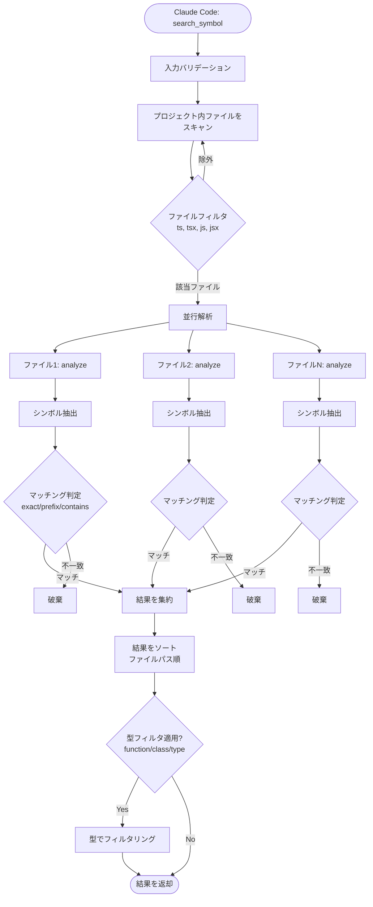
```mermaid
flowchart TD
    Start([Claude Code: search_symbol]) --> Validate[入力バリデーション]
    Validate --> ScanFiles[プロジェクト内ファイルをスキャン]
    ScanFiles --> FilterFiles{ファイルフィルタ<br/>ts, tsx, js, jsx}

    FilterFiles -->|該当ファイル| ParallelAnalysis[並行解析]
    FilterFiles -->|除外| ScanFiles

    ParallelAnalysis --> File1[ファイル1: analyze]
    ParallelAnalysis --> File2[ファイル2: analyze]
    ParallelAnalysis --> FileN[ファイルN: analyze]

    File1 --> Extract1[シンボル抽出]
    File2 --> Extract2[シンボル抽出]
    FileN --> ExtractN[シンボル抽出]

    Extract1 --> Match1{マッチング判定<br/>exact/prefix/contains}
    Extract2 --> Match2{マッチング判定}
    ExtractN --> MatchN{マッチング判定}

    Match1 -->|マッチ| Collect[結果を集約]
    Match2 -->|マッチ| Collect
    MatchN -->|マッチ| Collect

    Match1 -->|不一致| Discard1[破棄]
    Match2 -->|不一致| Discard2[破棄]
    MatchN -->|不一致| DiscardN[破棄]

    Collect --> Sort[結果をソート<br/>ファイルパス順]
    Sort --> TypeFilter{型フィルタ適用?<br/>function/class/type}

    TypeFilter -->|Yes| FilterByType[型でフィルタリング]
    TypeFilter -->|No| Return

    FilterByType --> Return([結果を返却])
```

### 2.2 シンボル検索のシーケンス

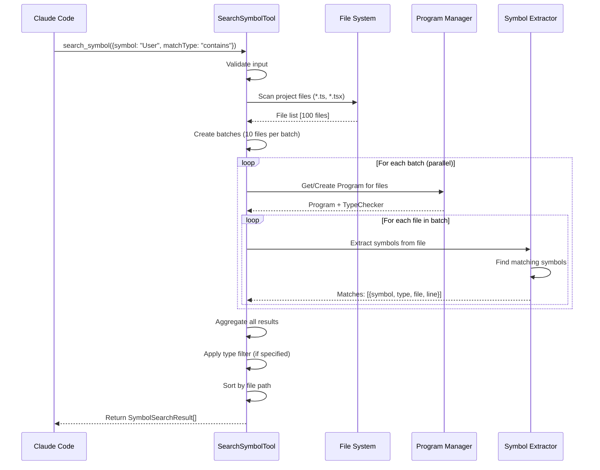
```mermaid
sequenceDiagram
    participant CC as Claude Code
    participant ST as SearchSymbolTool
    participant FS as File System
    participant PM as Program Manager
    participant SE as Symbol Extractor

    CC->>ST: search_symbol({symbol: "User", matchType: "contains"})
    ST->>ST: Validate input
    ST->>FS: Scan project files (*.ts, *.tsx)
    FS-->>ST: File list [100 files]

    ST->>ST: Create batches (10 files per batch)

    loop For each batch (parallel)
        ST->>PM: Get/Create Program for files
        PM-->>ST: Program + TypeChecker

        loop For each file in batch
            ST->>SE: Extract symbols from file
            SE->>SE: Find matching symbols
            SE-->>ST: Matches: [{symbol, type, file, line}]
        end
    end

    ST->>ST: Aggregate all results
    ST->>ST: Apply type filter (if specified)
    ST->>ST: Sort by file path
    ST-->>CC: Return SymbolSearchResult[]
```

---

## 3. analyze_project ツールのデータフロー

### 3.1 プロジェクト全体解析フロー

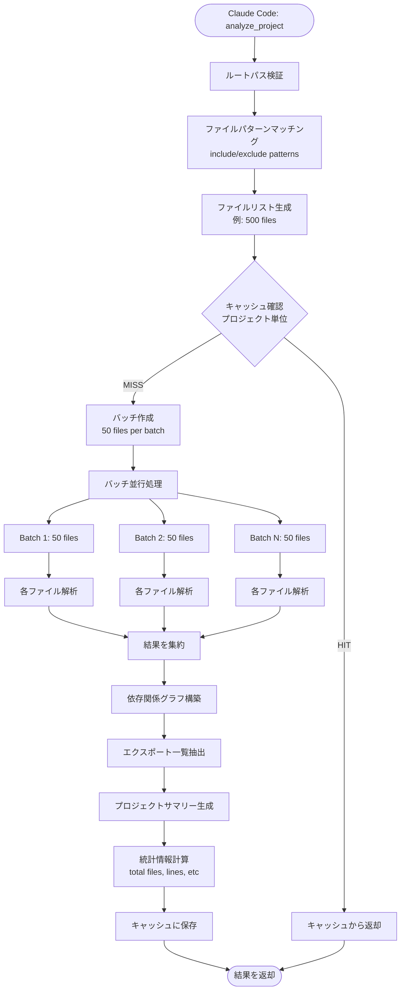
```mermaid
flowchart TD
    Start([Claude Code: analyze_project]) --> ValidatePath[ルートパス検証]
    ValidatePath --> GlobFiles[ファイルパターンマッチング<br/>include/exclude patterns]

    GlobFiles --> FileList[ファイルリスト生成<br/>例: 500 files]
    FileList --> CheckCache{キャッシュ確認<br/>プロジェクト単位}

    CheckCache -->|HIT| ReturnCached[キャッシュから返却]
    CheckCache -->|MISS| BatchCreate[バッチ作成<br/>50 files per batch]

    BatchCreate --> ParallelBatches[バッチ並行処理]

    ParallelBatches --> Batch1[Batch 1: 50 files]
    ParallelBatches --> Batch2[Batch 2: 50 files]
    ParallelBatches --> BatchN[Batch N: 50 files]

    Batch1 --> Analyze1[各ファイル解析]
    Batch2 --> Analyze2[各ファイル解析]
    BatchN --> AnalyzeN[各ファイル解析]

    Analyze1 --> Collect[結果を集約]
    Analyze2 --> Collect
    AnalyzeN --> Collect

    Collect --> BuildDepGraph[依存関係グラフ構築]
    BuildDepGraph --> ExtractExports[エクスポート一覧抽出]
    ExtractExports --> GenSummary[プロジェクトサマリー生成]

    GenSummary --> CalcStats[統計情報計算<br/>total files, lines, etc]
    CalcStats --> StoreCache[キャッシュに保存]
    StoreCache --> Return

    ReturnCached --> Return([結果を返却])
```

### 3.2 依存関係グラフの構築

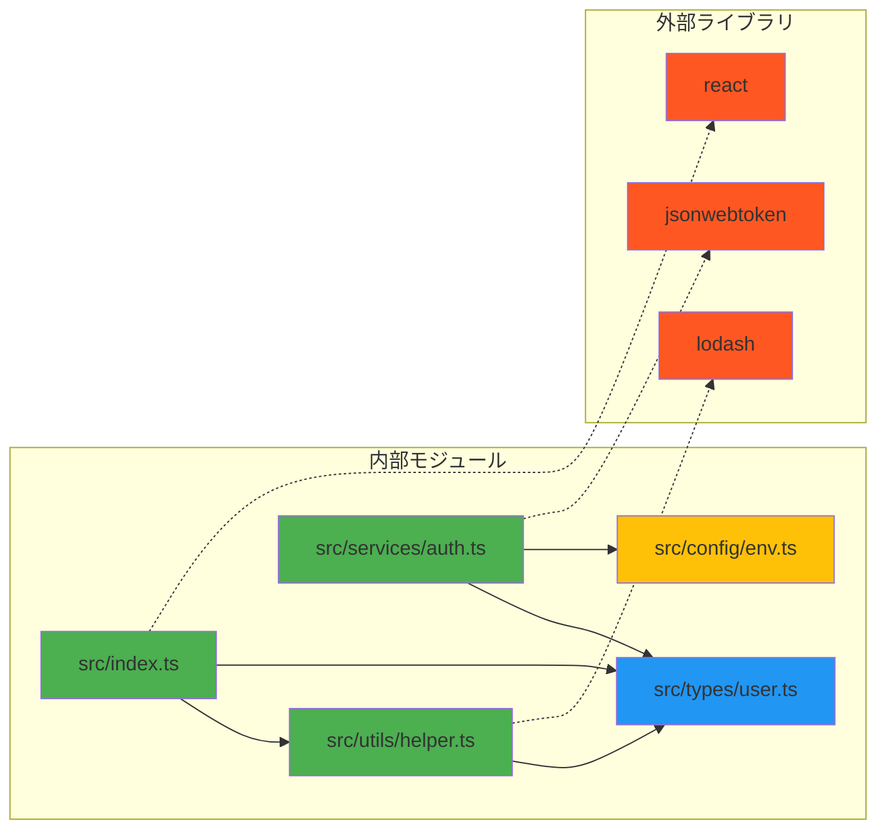
```mermaid
graph LR
    subgraph "内部モジュール"
        A[src/index.ts] --> B[src/utils/helper.ts]
        A --> C[src/types/user.ts]
        B --> C
        D[src/services/auth.ts] --> C
        D --> E[src/config/env.ts]
    end

    subgraph "外部ライブラリ"
        A -.-> F[react]
        D -.-> G[jsonwebtoken]
        B -.-> H[lodash]
    end

    style A fill:#4CAF50
    style B fill:#4CAF50
    style C fill:#2196F3
    style D fill:#4CAF50
    style E fill:#FFC107
    style F fill:#FF5722
    style G fill:#FF5722
    style H fill:#FF5722
```

---

## 4. get_dependencies ツールのデータフロー

### 4.1 依存関係解析フロー

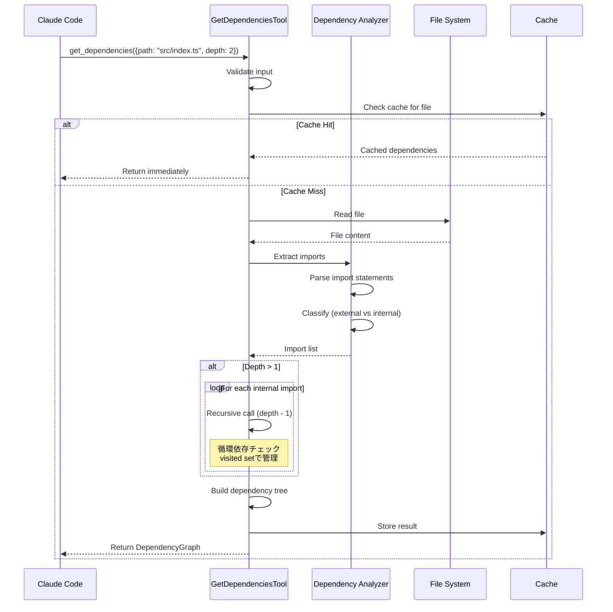
```mermaid
sequenceDiagram
    participant CC as Claude Code
    participant GD as GetDependenciesTool
    participant DA as Dependency Analyzer
    participant FS as File System
    participant Cache as Cache

    CC->>GD: get_dependencies({path: "src/index.ts", depth: 2})
    GD->>GD: Validate input
    GD->>Cache: Check cache for file

    alt Cache Hit
        Cache-->>GD: Cached dependencies
        GD-->>CC: Return immediately
    else Cache Miss
        GD->>FS: Read file
        FS-->>GD: File content

        GD->>DA: Extract imports
        DA->>DA: Parse import statements
        DA->>DA: Classify (external vs internal)
        DA-->>GD: Import list

        alt Depth > 1
            loop For each internal import
                GD->>GD: Recursive call (depth - 1)
                Note over GD: 循環依存チェック<br/>visited setで管理
            end
        end

        GD->>GD: Build dependency tree
        GD->>Cache: Store result
        GD-->>CC: Return DependencyGraph
    end
```

### 4.2 循環依存の検出

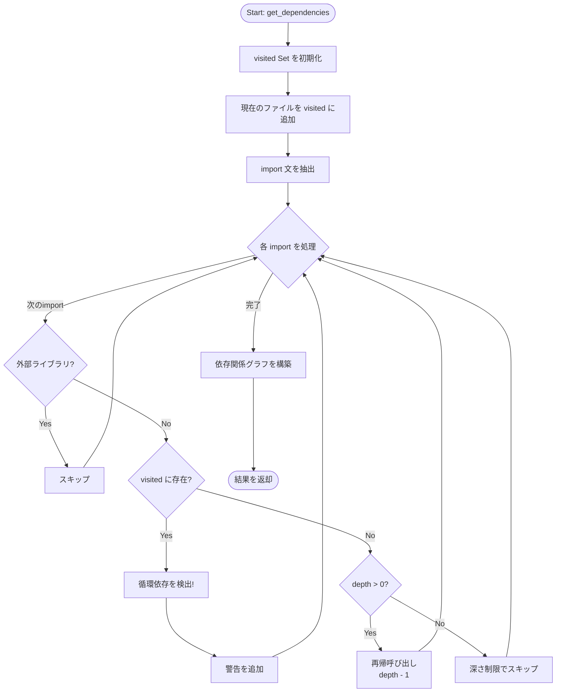
```mermaid
flowchart TD
    Start([Start: get_dependencies]) --> InitVisited[visited Set を初期化]
    InitVisited --> AddCurrent[現在のファイルを visited に追加]
    AddCurrent --> ExtractImports[import 文を抽出]

    ExtractImports --> Loop{各 import を処理}
    Loop -->|次のimport| CheckExternal{外部ライブラリ?}

    CheckExternal -->|Yes| SkipExternal[スキップ]
    CheckExternal -->|No| CheckVisited{visited に存在?}

    CheckVisited -->|Yes| CircularDetected[循環依存を検出!]
    CheckVisited -->|No| CheckDepth{depth > 0?}

    CheckDepth -->|Yes| RecursiveCall[再帰呼び出し<br/>depth - 1]
    CheckDepth -->|No| SkipDepth[深さ制限でスキップ]

    CircularDetected --> AddWarning[警告を追加]
    AddWarning --> Loop

    RecursiveCall --> Loop
    SkipExternal --> Loop
    SkipDepth --> Loop

    Loop -->|完了| BuildGraph[依存関係グラフを構築]
    BuildGraph --> Return([結果を返却])
```

---

## 5. キャッシュ管理のデータフロー

### 5.1 キャッシュの読み書きフロー

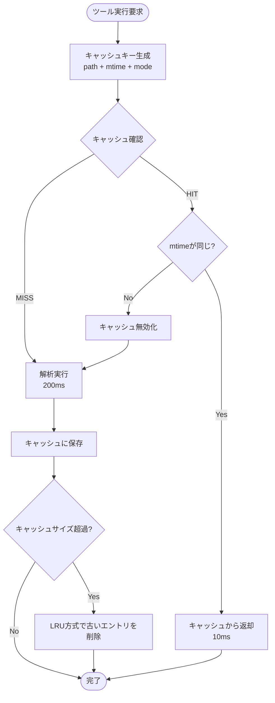
```mermaid
flowchart TD
    Request([ツール実行要求]) --> GenKey[キャッシュキー生成<br/>path + mtime + mode]
    GenKey --> CheckCache{キャッシュ確認}

    CheckCache -->|HIT| ValidateMtime{mtimeが同じ?}
    ValidateMtime -->|Yes| ReturnCached[キャッシュから返却<br/>10ms]
    ValidateMtime -->|No| InvalidateCache[キャッシュ無効化]

    CheckCache -->|MISS| PerformAnalysis[解析実行<br/>200ms]
    InvalidateCache --> PerformAnalysis

    PerformAnalysis --> StoreCache[キャッシュに保存]
    StoreCache --> CheckSize{キャッシュサイズ超過?}

    CheckSize -->|Yes| EvictLRU[LRU方式で古いエントリを削除]
    CheckSize -->|No| Done

    EvictLRU --> Done([完了])
    ReturnCached --> Done
```

### 5.2 キャッシュエントリの構造

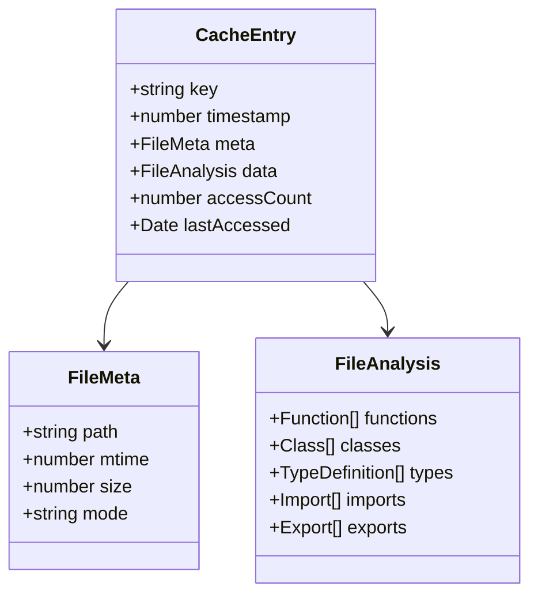
```mermaid
classDiagram
    class CacheEntry {
        +string key
        +number timestamp
        +FileMeta meta
        +FileAnalysis data
        +number accessCount
        +Date lastAccessed
    }

    class FileMeta {
        +string path
        +number mtime
        +number size
        +string mode
    }

    class FileAnalysis {
        +Function[] functions
        +Class[] classes
        +TypeDefinition[] types
        +Import[] imports
        +Export[] exports
    }

    CacheEntry --> FileMeta
    CacheEntry --> FileAnalysis
```

---

## 6. 並行処理のデータフロー

### 6.1 ファイル並行解析

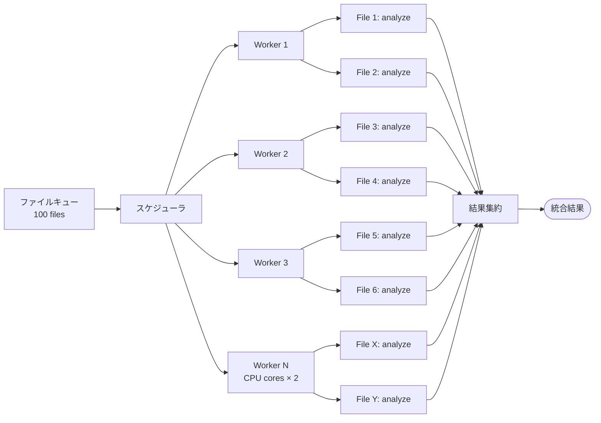
```mermaid
flowchart LR
    Queue[ファイルキュー<br/>100 files] --> Scheduler[スケジューラ]

    Scheduler --> Worker1[Worker 1]
    Scheduler --> Worker2[Worker 2]
    Scheduler --> Worker3[Worker 3]
    Scheduler --> WorkerN[Worker N<br/>CPU cores × 2]

    Worker1 --> File1[File 1: analyze]
    Worker1 --> File2[File 2: analyze]

    Worker2 --> File3[File 3: analyze]
    Worker2 --> File4[File 4: analyze]

    Worker3 --> File5[File 5: analyze]
    Worker3 --> File6[File 6: analyze]

    WorkerN --> FileX[File X: analyze]
    WorkerN --> FileY[File Y: analyze]

    File1 --> Aggregator[結果集約]
    File2 --> Aggregator
    File3 --> Aggregator
    File4 --> Aggregator
    File5 --> Aggregator
    File6 --> Aggregator
    FileX --> Aggregator
    FileY --> Aggregator

    Aggregator --> Result([統合結果])
```

### 6.2 並行処理の実装パターン

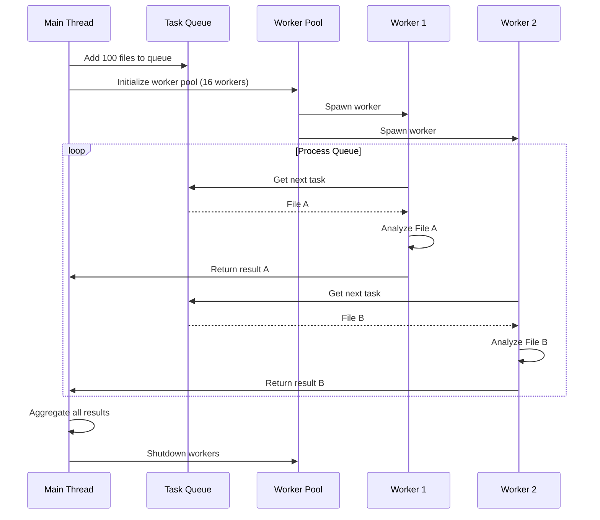
```mermaid
sequenceDiagram
    participant Main as Main Thread
    participant Queue as Task Queue
    participant Pool as Worker Pool
    participant W1 as Worker 1
    participant W2 as Worker 2

    Main->>Queue: Add 100 files to queue
    Main->>Pool: Initialize worker pool (16 workers)

    Pool->>W1: Spawn worker
    Pool->>W2: Spawn worker

    loop Process Queue
        W1->>Queue: Get next task
        Queue-->>W1: File A
        W1->>W1: Analyze File A
        W1->>Main: Return result A

        W2->>Queue: Get next task
        Queue-->>W2: File B
        W2->>W2: Analyze File B
        W2->>Main: Return result B
    end

    Main->>Main: Aggregate all results
    Main->>Pool: Shutdown workers
```

---

## 7. エラーリカバリのデータフロー

### 7.1 部分的成功のフロー

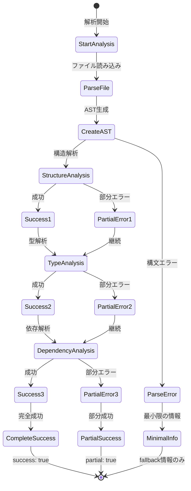
```mermaid
stateDiagram-v2
    [*] --> StartAnalysis: 解析開始

    StartAnalysis --> ParseFile: ファイル読み込み
    ParseFile --> CreateAST: AST生成

    CreateAST --> StructureAnalysis: 構造解析
    CreateAST --> ParseError: 構文エラー

    StructureAnalysis --> Success1: 成功
    StructureAnalysis --> PartialError1: 部分エラー

    Success1 --> TypeAnalysis: 型解析
    PartialError1 --> TypeAnalysis: 継続

    TypeAnalysis --> Success2: 成功
    TypeAnalysis --> PartialError2: 部分エラー

    Success2 --> DependencyAnalysis: 依存解析
    PartialError2 --> DependencyAnalysis: 継続

    DependencyAnalysis --> Success3: 成功
    DependencyAnalysis --> PartialError3: 部分エラー

    Success3 --> CompleteSuccess: 完全成功
    PartialError3 --> PartialSuccess: 部分成功
    ParseError --> MinimalInfo: 最小限の情報

    CompleteSuccess --> [*]: success: true
    PartialSuccess --> [*]: partial: true
    MinimalInfo --> [*]: fallback情報のみ
```

---

## 8. モード別出力のデータフロー

### 8.1 簡潔モード vs 詳細モードの比較

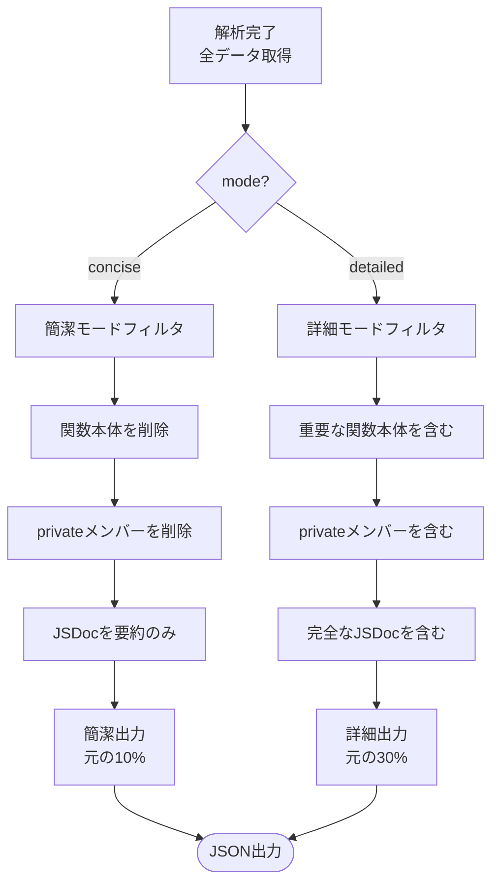
```mermaid
flowchart TD
    Analysis[解析完了<br/>全データ取得] --> ModeCheck{mode?}

    ModeCheck -->|concise| ConciseFilter[簡潔モードフィルタ]
    ModeCheck -->|detailed| DetailedFilter[詳細モードフィルタ]

    ConciseFilter --> RemoveBody[関数本体を削除]
    RemoveBody --> RemovePrivate[privateメンバーを削除]
    RemovePrivate --> SimplifyDocs[JSDocを要約のみ]
    SimplifyDocs --> ConciseOutput[簡潔出力<br/>元の10%]

    DetailedFilter --> IncludeBody[重要な関数本体を含む]
    IncludeBody --> IncludePrivate[privateメンバーを含む]
    IncludePrivate --> FullDocs[完全なJSDocを含む]
    FullDocs --> DetailedOutput[詳細出力<br/>元の30%]

    ConciseOutput --> Return([JSON出力])
    DetailedOutput --> Return
```

### 8.2 出力サイズの比較

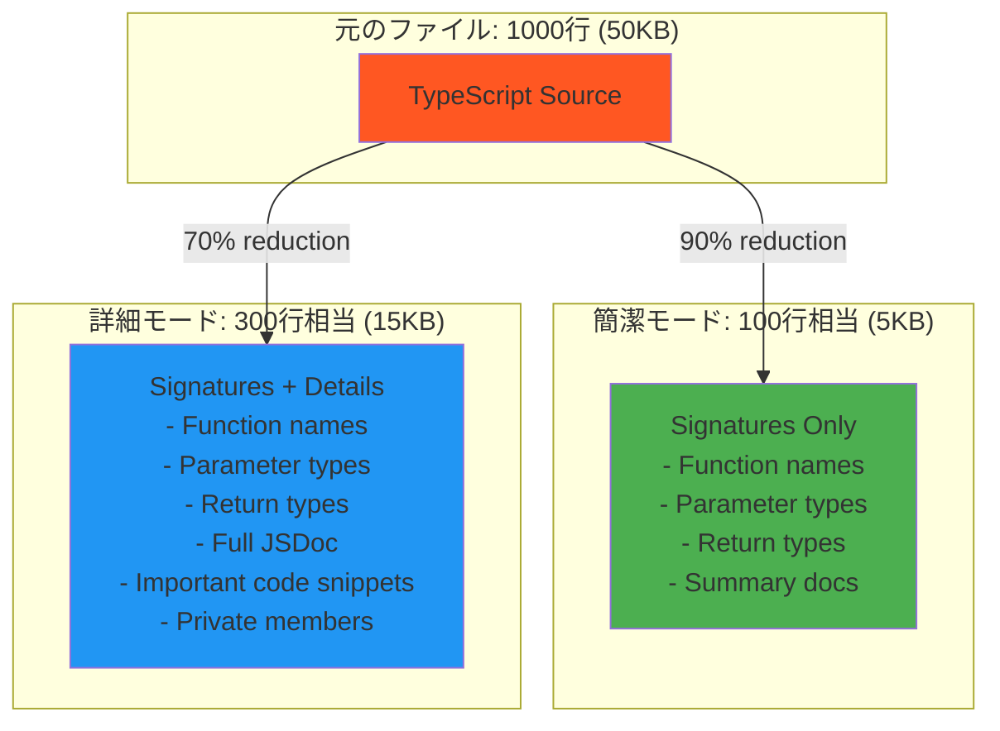
```mermaid
graph TD
    subgraph "元のファイル: 1000行 (50KB)"
        Original[TypeScript Source]
    end

    subgraph "簡潔モード: 100行相当 (5KB)"
        Concise[Signatures Only<br/>- Function names<br/>- Parameter types<br/>- Return types<br/>- Summary docs]
    end

    subgraph "詳細モード: 300行相当 (15KB)"
        Detailed[Signatures + Details<br/>- Function names<br/>- Parameter types<br/>- Return types<br/>- Full JSDoc<br/>- Important code snippets<br/>- Private members]
    end

    Original -->|90% reduction| Concise
    Original -->|70% reduction| Detailed

    style Original fill:#FF5722
    style Concise fill:#4CAF50
    style Detailed fill:#2196F3
```

---

## 9. 統合データフロー (全体像)

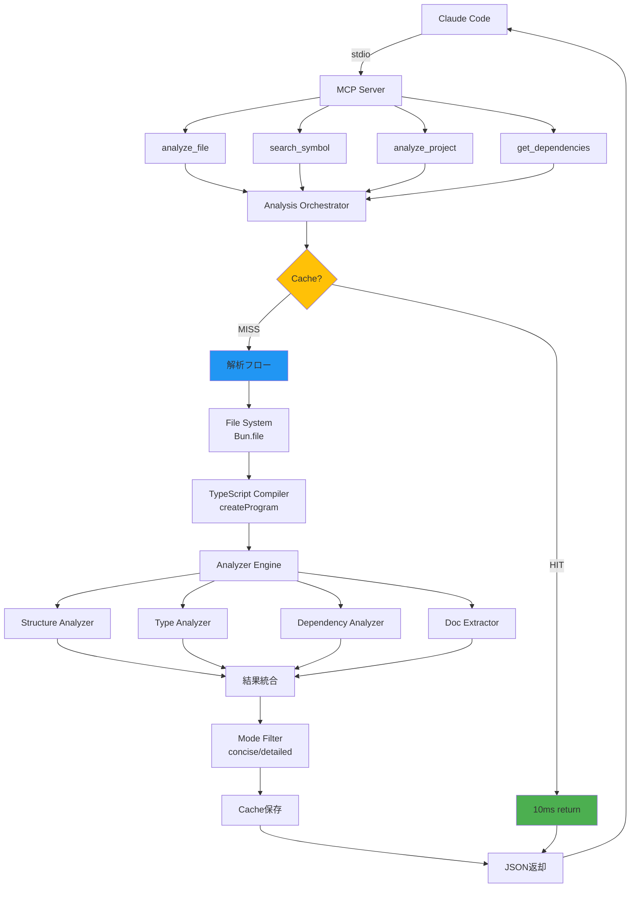
```mermaid
flowchart TD
    Claude[Claude Code] -->|stdio| MCP[MCP Server]

    MCP --> Tool1[analyze_file]
    MCP --> Tool2[search_symbol]
    MCP --> Tool3[analyze_project]
    MCP --> Tool4[get_dependencies]

    Tool1 --> Orchestrator[Analysis Orchestrator]
    Tool2 --> Orchestrator
    Tool3 --> Orchestrator
    Tool4 --> Orchestrator

    Orchestrator --> Cache{Cache?}
    Cache -->|HIT| FastReturn[10ms return]
    Cache -->|MISS| AnalyzeFlow[解析フロー]

    AnalyzeFlow --> FileSystem[File System<br/>Bun.file]
    FileSystem --> Compiler[TypeScript Compiler<br/>createProgram]
    Compiler --> Analyzers[Analyzer Engine]

    Analyzers --> A1[Structure Analyzer]
    Analyzers --> A2[Type Analyzer]
    Analyzers --> A3[Dependency Analyzer]
    Analyzers --> A4[Doc Extractor]

    A1 --> Combine[結果統合]
    A2 --> Combine
    A3 --> Combine
    A4 --> Combine

    Combine --> ModeFilter[Mode Filter<br/>concise/detailed]
    ModeFilter --> StoreCache[Cache保存]
    StoreCache --> Return[JSON返却]

    FastReturn --> Return
    Return --> Claude

    style Cache fill:#FFC107
    style FastReturn fill:#4CAF50
    style AnalyzeFlow fill:#2196F3
```

---

## 10. パフォーマンス最適化のデータフロー

### 10.1 段階的な最適化戦略

```mermaid
timeline
    title 解析パフォーマンスの段階的最適化

    section Phase 1: 基本実装
        初回リクエスト : 200ms : キャッシュなし

    section Phase 2: キャッシュ導入
        2回目リクエスト : 10ms : キャッシュヒット

    section Phase 3: 並行処理
        10ファイル解析 : 2000ms : 並行処理 (16 workers)

    section Phase 4: 増分解析
        部分変更 : 50ms : 変更部分のみ再解析
```

---

## まとめ

このデータフロー設計により、以下が実現されます:

1. **高速なレスポンス**: キャッシュヒット時は10ms以内
2. **並行処理**: 複数ファイルを効率的に解析
3. **堅牢なエラーハンドリング**: 部分的成功の実装
4. **コンテキスト効率**: 簡潔モードで90%削減

**次のステップ**:
- TypeScriptインターフェース定義 → `interfaces.ts`
- 詳細なキャッシュ設計 → `cache-design.md`

---

**作成日**: 2025-10-29
**対応要件**: REQ-001〜REQ-405
**関連文書**: [architecture](./architecture.md), [requirements](../../spec/code-analysis-requirements.md)
