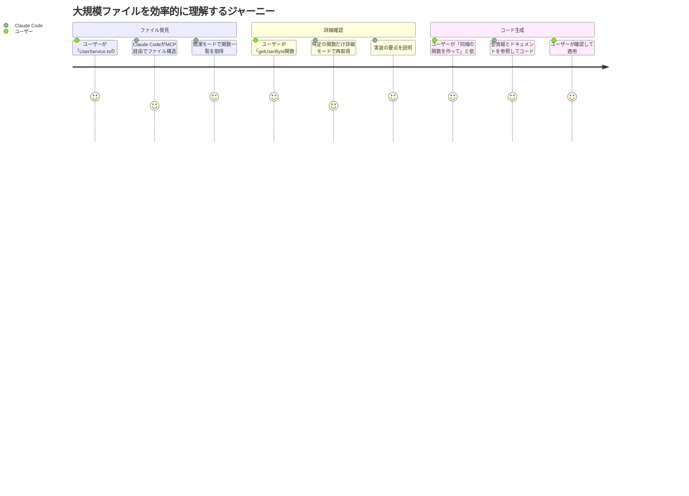
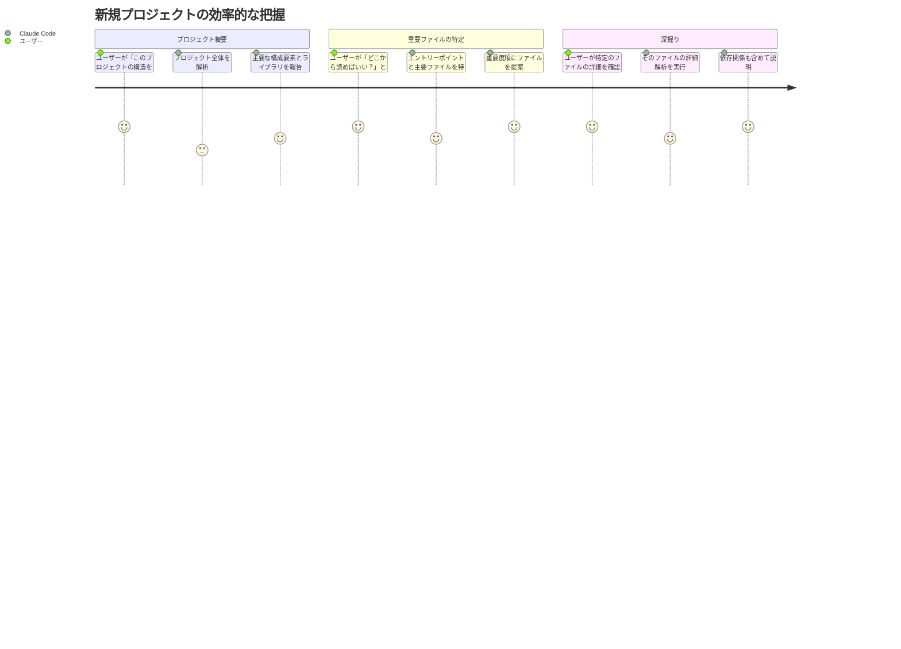

# コード解析MCP ユーザストーリー

## 概要

このドキュメントは、コード解析MCPサーバーの詳細なユーザストーリーを記載します。本サーバーの目的は**Claude Codeのコンテキスト消費を削減**し、効率的なコード理解を支援することです。

## ユーザー種別の定義

### プライマリユーザー

- **Claude Code**: MCPクライアントとして接続し、ファイル解析結果を活用してユーザーのコーディングを支援するAIシステム
- **開発者**: Claude Codeを使用してコーディングを行うエンジニア
- **AI開発者**: Claude Codeの機能拡張やMCPサーバー開発を行う技術者

### セカンダリユーザー

- **プロジェクト管理者**: コードベースの全体像を把握したい管理者
- **レビュアー**: コードレビュー時に構造を素早く理解したい技術者

## ユーザストーリー

**【信頼性レベル凡例】**:
- 🔵 **青信号**: tech-stack.md・ユーザヒアリング（2025-10-29）を参考にした確実なストーリー
- 🟡 **黄信号**: tech-stack.md・ユーザヒアリングから妥当な推測によるストーリー
- 🔴 **赤信号**: 既存資料にない推測によるストーリー

---

### 📚 エピック1: コンテキスト効率的なコード理解 🔵 *ユーザヒアリング2025-10-29（主目的）より*

#### ストーリー1.1: ファイル構造の素早い把握 🔵 *ユーザヒアリング2025-10-29（機能1）より*

**ユーザストーリー**:
- **私は** 開発者（Claude Codeを使用） **として**
- **大規模なTypeScriptファイル（1000行以上）の内容を理解したい状況において**
- **ファイル全体を読み込む代わりに、関数とクラスの構造だけを素早く把握したい**
- **そうすることで** コンテキストを節約しながら、ファイルの全体像を短時間で理解できる

**詳細説明**:
- **背景**: 大規模ファイルを全て読み込むと、Claude Codeのコンテキスト上限に達しやすい。構造情報だけを取得すれば、必要な関数だけを詳しく見ることができる。
- **前提条件**:
  - MCPサーバーが起動している
  - 対象ファイルがTypeScript/JavaScript
  - Claude Codeのワークスペース内のファイル
- **利用シーン**:
  - 「このファイルにどんな関数があるか教えて」
  - 「UserServiceクラスにはどんなメソッドがある？」
  - 「このファイルの構造を教えて」
- **期待する体験**:
  - 1000行のファイルでも1秒以内に構造を取得
  - 関数名、引数の型、戻り値の型が一覧で見える
  - 実装の詳細は含まれず、シグネチャのみ

**関連要件**: REQ-001, REQ-002, REQ-003, REQ-061, REQ-063, NFR-002, NFR-101

**優先度**: 高（MVP Phase 1）

**見積もり**: 5日

---

#### ストーリー1.2: 型定義の効率的な参照 🔵 *ユーザヒアリング2025-10-29（機能5）より*

**ユーザストーリー**:
- **私は** Claude Code **として**
- **ユーザーがコードを書いている際に型情報が必要な状況において**
- **ファイル全体を読まずに、interface/type定義だけを取得したい**
- **そうすることで** 必要最小限のコンテキストで型安全なコード生成ができる

**詳細説明**:
- **背景**: TypeScript開発では型情報が重要だが、実装の詳細は不要な場合が多い。型定義だけを抽出できれば、コンテキストを大幅に節約できる。
- **前提条件**:
  - TypeScriptファイルに型定義が含まれている
- **利用シーン**:
  - 「Userインターフェースにどんなプロパティがある？」
  - 「このファイルで定義されている型を全て教えて」
  - 「RequestType型の定義を見せて」
- **期待する体験**:
  - interface, type, enumが一覧表示される
  - 各プロパティの型情報が含まれる
  - ジェネリック型パラメータも表示される

**関連要件**: REQ-041, REQ-042, REQ-043, REQ-044, REQ-045, NFR-101

**優先度**: 高（MVP Phase 1）

**見積もり**: 4日

---

#### ストーリー1.3: ドキュメントの自動抽出 🔵 *ユーザヒアリング2025-10-29（機能6）より*

**ユーザストーリー**:
- **私は** Claude Code **として**
- **関数の使い方を説明する必要がある状況において**
- **JSDocコメントだけを抽出して、簡潔な説明を提供したい**
- **そうすることで** コード本体を見なくても、関数の目的と使い方を説明できる

**詳細説明**:
- **背景**: 適切にドキュメント化されたコードでは、JSDocに重要な情報が集約されている。これを抽出すれば、実装を読まずに関数を理解できる。
- **前提条件**:
  - 関数/クラスにJSDocコメントが記述されている
- **利用シーン**:
  - 「この関数は何をするの？」
  - 「このメソッドの引数は何を指定すればいい？」
  - 「戻り値はどんな型？」
- **期待する体験**:
  - JSDocの@param、@returns、@throws等が構造化されて返る
  - 非推奨（@deprecated）の関数は警告付きで表示される
  - コメントがない関数も、シグネチャから推測した説明が付く

**関連要件**: REQ-051, REQ-052, REQ-053, REQ-054, NFR-101

**優先度**: 高（MVP Phase 1）

**見積もり**: 3日

---

### 📚 エピック2: 効率的なコードナビゲーション 🔵 *ユーザヒアリング2025-10-29（機能2）より*

#### ストーリー2.1: シンボルの高速検索 🔵 *ユーザヒアリング2025-10-29（機能2）より*

**ユーザストーリー**:
- **私は** 開発者 **として**
- **特定の関数やクラスがどこで定義されているか知りたい状況において**
- **プロジェクト全体を grep する代わりに、構造化された検索で素早く見つけたい**
- **そうすることで** 定義ジャンプのような体験を、Claude Code経由で得られる

**詳細説明**:
- **背景**: 大規模プロジェクトでは、特定の関数がどこにあるか探すのが大変。構造解析済みのデータから検索すれば、瞬時に見つかる。
- **前提条件**:
  - プロジェクトが事前に解析されている（またはキャッシュあり）
- **利用シーン**:
  - 「getUserById関数はどこで定義されている？」
  - 「Userで始まるクラスを全て教えて」
  - 「createという名前の関数を探して」
- **期待する体験**:
  - 検索結果にファイルパスと行番号が含まれる
  - 部分一致検索ができる
  - 型別（関数/クラス/型定義）でフィルタできる

**関連要件**: REQ-011, REQ-012, REQ-013, REQ-014, NFR-002

**優先度**: 高（MVP Phase 1）

**見積もり**: 4日

---

#### ストーリー2.2: 依存関係の可視化 🔵 *ユーザヒアリング2025-10-29（機能3）より*

**ユーザストーリー**:
- **私は** Claude Code **として**
- **ファイルが他のどのモジュールに依存しているか知りたい状況において**
- **import文を解析して、依存関係を構造化して把握したい**
- **そうすることで** モジュール間の関係を理解し、適切なコード提案ができる

**詳細説明**:
- **背景**: コードを変更する際、どのモジュールに影響があるか知る必要がある。依存関係が明確なら、安全なリファクタリングが可能。
- **前提条件**:
  - ファイルにimport文が存在する
- **利用シーン**:
  - 「このファイルはどのライブラリを使っている？」
  - 「内部モジュールの依存関係を教えて」
  - 「このファイルを変更したら、どこに影響がある？」
- **期待する体験**:
  - 外部ライブラリと内部モジュールが区別される
  - 動的import（`import()`）も検出される
  - 循環依存があれば警告が表示される

**関連要件**: REQ-021, REQ-022, REQ-023, REQ-024, EDGE-003

**優先度**: 高（MVP Phase 1）

**見積もり**: 4日

---

### 📚 エピック3: プロジェクト全体の把握 🔵 *ユーザヒアリング2025-10-29（機能4）より*

#### ストーリー3.1: プロジェクトサマリーの自動生成 🔵 *ユーザヒアリング2025-10-29（機能4）より*

**ユーザストーリー**:
- **私は** 開発者 **として**
- **初めて触るプロジェクトの全体像を把握したい状況において**
- **プロジェクト全体を解析して、主要な構成要素を要約してほしい**
- **そうすることで** 短時間でプロジェクトの構造と主要機能を理解できる

**詳細説明**:
- **背景**: 新しいプロジェクトに参加した際、どこから読めばいいか分からない。自動生成されたサマリーがあれば、効率的にキャッチアップできる。
- **前提条件**:
  - プロジェクトルートディレクトリが指定されている
- **利用シーン**:
  - 「このプロジェクトの構造を教えて」
  - 「主要な機能は何？」
  - 「どんなライブラリを使っている？」
- **期待する体験**:
  - ファイル数、総行数などの統計情報
  - 主要なエクスポート（公開API）の一覧
  - 使用している外部ライブラリの一覧
  - ディレクトリ構造の概要

**関連要件**: REQ-031, REQ-032, REQ-033, NFR-101

**優先度**: 中（MVP Phase 1）

**見積もり**: 5日

---

#### ストーリー3.2: ファイル単位のサマリー 🔵 *ユーザヒアリング2025-10-29（機能4）より*

**ユーザストーリー**:
- **私は** Claude Code **として**
- **ファイルの役割を一言で説明する必要がある状況において**
- **ファイル全体を読まずに、目的と主要機能を要約したい**
- **そうすることで** ユーザーに簡潔な説明を提供できる

**詳細説明**:
- **背景**: 「このファイルは何をするファイル？」という質問に答える際、全体を読むのは非効率。自動生成されたサマリーで十分。
- **前提条件**:
  - ファイルが適切に構造化されている
- **利用シーン**:
  - 「このファイルは何をするの？」
  - 「UserService.tsの役割を説明して」
  - 「このファイルはどんな機能を提供している？」
- **期待する体験**:
  - ファイルの役割が1-2文で要約される
  - 主要なエクスポート関数/クラスがリストアップされる
  - ファイルの種類（ユーティリティ、コンポーネント、型定義等）が推測される

**関連要件**: REQ-031, REQ-032, REQ-033, NFR-101

**優先度**: 中（MVP Phase 1）

**見積もり**: 3日

---

### 📚 エピック4: 堅牢なエラーハンドリング 🔵 *ユーザヒアリング2025-10-29（質問8）より*

#### ストーリー4.1: 部分的な成功でも有用な情報を返す 🔵 *ユーザヒアリング2025-10-29（質問8）より*

**ユーザストーリー**:
- **私は** Claude Code **として**
- **構文エラーのあるファイルを解析する状況において**
- **エラーで全て失敗するのではなく、解析できた部分だけでも情報を返したい**
- **そうすることで** 不完全なコードでも、Claude Codeが有用な支援を提供できる

**詳細説明**:
- **背景**: 開発中のコードは構文エラーを含むことが多い。エラーで何も返さないより、解析できた部分だけでも返す方が有用。
- **前提条件**:
  - ファイルに構文エラーがある
- **利用シーン**:
  - 「この（エラーのある）ファイルから、型定義だけでも抽出して」
  - 「構文エラーがあるけど、import文は読み取れる？」
- **期待する体験**:
  - 解析できた部分（import文、型定義等）は正しく返される
  - エラー情報も併記される
  - フォールバックとして基本情報（ファイルサイズ、行数）は必ず返る

**関連要件**: REQ-101, REQ-102, REQ-103, NFR-401, NFR-402, EDGE-001

**優先度**: 高（MVP Phase 1）

**見積もり**: 3日

---

#### ストーリー4.2: 複数ファイル解析の継続 🔵 *ユーザヒアリング2025-10-29（質問8）より*

**ユーザストーリー**:
- **私は** Claude Code **として**
- **プロジェクト全体を解析中に、一部のファイルでエラーが発生した状況において**
- **エラーのあるファイルをスキップして、他のファイルの解析を継続したい**
- **そうすることで** プロジェクト全体の大部分の情報を取得できる

**詳細説明**:
- **背景**: 大規模プロジェクトでは、一部のファイルにエラーがあることは珍しくない。一つのエラーで全体が失敗するのは非効率。
- **前提条件**:
  - 複数ファイルの解析を実行している
- **利用シーン**:
  - 「プロジェクト全体を解析して（一部にエラーがあっても）」
  - 「srcディレクトリ配下の全ファイルを解析して」
- **期待する体験**:
  - 成功したファイルの結果は正しく返される
  - 失敗したファイルのリストとエラー理由が返される
  - 部分的成功が明確に示される

**関連要件**: REQ-104, NFR-402

**優先度**: 中（MVP Phase 1）

**見積もり**: 2日

---

### 📚 エピック5: パフォーマンス最適化 🔵 *ユーザヒアリング2025-10-29（質問6）より*

#### ストーリー5.1: キャッシュによる高速化 🔵 *ユーザヒアリング2025-10-29（質問6）より*

**ユーザストーリー**:
- **私は** Claude Code **として**
- **同じファイルを何度も解析する状況において**
- **一度解析した結果をキャッシュして、次回は即座に返したい**
- **そうすることで** レスポンスタイムを大幅に短縮できる

**詳細説明**:
- **背景**: 開発中は同じファイルを何度も参照することが多い。毎回解析するのは無駄。
- **前提条件**:
  - ファイルが変更されていない（更新日時が同じ）
- **利用シーン**:
  - ユーザーが同じファイルについて複数の質問をする
  - プロジェクト構造を何度も参照する
- **期待する体験**:
  - 初回は200ms、2回目以降は10ms以内
  - ファイルが更新されたら自動的にキャッシュが無効化される
  - キャッシュヒット率が高い

**関連要件**: REQ-111, REQ-202, NFR-005

**優先度**: 中（MVP Phase 1）

**見積もり**: 3日

---

#### ストーリー5.2: 増分解析による効率化 🔵 *ユーザヒアリング2025-10-29（質問6）より*

**ユーザストーリー**:
- **私は** MCPサーバー開発者 **として**
- **ファイルの一部だけが変更された状況において**
- **全体を再解析せず、変更部分のみを再解析したい**
- **そうすることで** リソース使用量を最小化できる

**詳細説明**:
- **背景**: 大規模ファイルの一部だけ変更された場合、全体を再解析するのは無駄。増分解析で効率化できる。
- **前提条件**:
  - 以前の解析結果がキャッシュされている
  - ファイルの変更箇所が特定できる
- **利用シーン**:
  - ユーザーが関数を1つ追加した
  - コメントを修正した
- **期待する体験**:
  - 変更部分のみが再解析される
  - 全体解析より10倍以上高速
  - 結果の整合性は保たれる

**関連要件**: REQ-112, NFR-006

**優先度**: 低（MVP Phase 2）

**見積もり**: 5日

---

#### ストーリー5.3: 並行処理による高速化 🔵 *ユーザヒアリング2025-10-29（質問6）より*

**ユーザストーリー**:
- **私は** Claude Code **として**
- **複数のファイルを同時に解析したい状況において**
- **並行処理で効率的に解析を実行したい**
- **そうすることで** プロジェクト全体の解析時間を大幅に短縮できる

**詳細説明**:
- **背景**: プロジェクト全体の解析では、複数ファイルを並行処理できればトータル時間が短縮される。
- **前提条件**:
  - 複数ファイルの解析要求を受けている
- **利用シーン**:
  - 「srcディレクトリ配下の全ファイルを解析して」
  - プロジェクト初回解析時
- **期待する体験**:
  - 10ファイルの解析が2秒以内（並行処理なしだと10秒）
  - CPU使用率が適切に管理される
  - メモリ使用量も制限内

**関連要件**: REQ-113, NFR-006

**優先度**: 中（MVP Phase 1）

**見積もり**: 4日

---

## ユーザージャーニー

### ジャーニー1: 大規模ファイルの効率的な理解 🔵 *ユーザヒアリング2025-10-29より*

**詳細**:
1. **構造取得**: 1000行のファイルから、関数一覧（100行相当）のみ取得
2. **詳細確認**: 必要な関数だけ詳細モードで確認
3. **コード生成**: 型情報を参照して型安全なコードを生成
4. **コンテキスト消費**: 従来の1/10以下に削減

---

### ジャーニー2: プロジェクト初見時の効率的なキャッチアップ 🟡 *ユーザヒアリング2025-10-29から妥当な推測*

**詳細**:
1. **プロジェクト解析**: 全ファイルをスキャンして統計とサマリーを生成
2. **重要ファイル特定**: エクスポート数、依存関係から重要度を算出
3. **段階的詳細化**: 必要に応じて詳細モードで深掘り
4. **時間短縮**: 従来1時間かかるキャッチアップが15分に短縮

---

## ペルソナ定義

### ペルソナ1: 田中さん（効率重視の開発者） 🔵 *ユーザヒアリング2025-10-29より*

- **基本情報**: 30歳、フルスタック開発者、技術レベル: 上級
- **ゴール**: Claude Codeを最大限活用して、開発効率を上げたい
- **課題**:
  - Claude Codeのコンテキスト上限にすぐ達してしまう
  - 大規模ファイルを読み込むとトークンを大量消費する
- **行動パターン**:
  - 毎日Claude Codeを使ってコーディング
  - 複数のファイルを行き来しながら開発
  - コード生成とリファクタリングを頻繁に実施
- **利用環境**: VSCode、TypeScript/React、大規模プロジェクト（1000ファイル以上）

**田中さんの要求**:
- ✅ ファイル全体を読まずに構造だけ把握したい
- ✅ 必要な関数だけ詳細モードで見たい
- ✅ コンテキストを節約して、長い会話を維持したい

---

### ペルソナ2: 佐藤さん（新規プロジェクト参加者） 🟡 *ユーザヒアリング2025-10-29から妥当な推測*

- **基本情報**: 25歳、バックエンドエンジニア、技術レベル: 中級
- **ゴール**: 新しいプロジェクトに参加し、早くキャッチアップしたい
- **課題**:
  - 大規模なコードベースのどこから読めばいいか分からない
  - 全体像を把握するのに時間がかかる
- **行動パターン**:
  - プロジェクトの README とコードを読む
  - 主要な機能を実装しているファイルを探す
  - チームメンバーに質問しながら理解を深める
- **利用環境**: VSCode、TypeScript/Node.js、中規模プロジェクト（300ファイル）

**佐藤さんの要求**:
- ✅ プロジェクト全体の構造を素早く把握したい
- ✅ 重要なファイルを特定してほしい
- ✅ 依存関係を可視化してほしい

---

### ペルソナ3: 鈴木さん（コードレビュアー） 🟡 *ユーザヒアリング2025-10-29から妥当な推測*

- **基本情報**: 35歳、シニアエンジニア、技術レベル: 上級
- **ゴール**: プルリクエストを効率的にレビューしたい
- **課題**:
  - 変更が広範囲に及ぶPRのレビューに時間がかかる
  - 変更の影響範囲を把握するのが大変
- **行動パターン**:
  - PRの差分を確認
  - 影響範囲を確認
  - コードの品質をチェック
- **利用環境**: GitHub、VSCode、大規模プロジェクト

**鈴木さんの要求**:
- ✅ 変更されたファイルの構造を素早く把握したい
- ✅ 依存関係から影響範囲を確認したい
- ✅ 型定義の変更が他に影響していないか確認したい

---

## 非機能的ユーザー要求

### ユーザビリティ要求

- **学習容易性**: Claude Codeから自然に使えること（特別な学習不要） 🔵
- **効率性**: コンテキスト消費を従来の1/10以下に削減すること 🔵
- **記憶しやすさ**: 簡潔/詳細モードの概念が直感的であること 🟡
- **エラー対応**: エラー時も部分的な情報が得られること 🔵
- **満足度**: 「ファイルを全部読む必要がなくなった」と実感できること 🔵

### アクセシビリティ要求

- **視覚**: JSON出力が構造化されており、Claude Codeが正しく解釈できること 🔵
- **聴覚**: （該当なし）
- **運動**: （該当なし：Claude Code経由で使用）
- **認知**: エラーメッセージが明確で、開発者が理解しやすいこと 🟡

## 更新履歴

- **2025-10-29**: 初回作成（ユーザヒアリング2025-10-29に基づく）
  - 5つのエピック（コンテキスト効率化、ナビゲーション、プロジェクト把握、エラーハンドリング、パフォーマンス）
  - 11の詳細ユーザストーリー
  - 2つのユーザージャーニー
  - 3つのペルソナ定義
